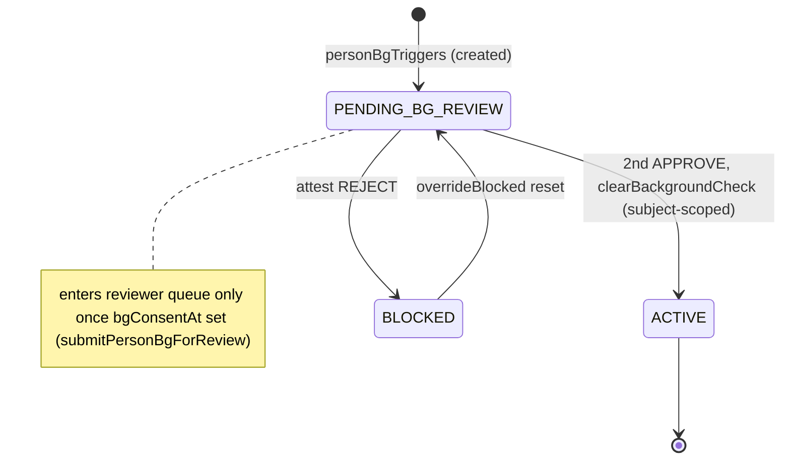

# OrgMembershipProcess lifecycle — one declarative definition

Status: **DRAFT — review before code.**
Scope: `OrgMembershipProcess` (membership dues / BG / renewal lifecycle) only.
The pattern, ratified decisions, seeing/assessing surfaces, and outbox/reconciler/CHECK
strategy live in the umbrella — **`LIFECYCLE_ARCHITECTURE.md`**. This doc is only what's
specific to this machine.
Out of scope: program-enrollment lifecycle — separate machine,
`PROGRAM_ENROLLMENT_STATE_MACHINE.md`. `TODO(#278)` cart-attribute trust at
`webhooks/shopify/route.ts:103` — separate security issue.

---

## 1. Problem

"Which states may this action fire from" is hand-copied across server / client / SQL
and drifts. Four concrete sites:

1. **`isAwaitingBgReview` exists 3×** — TS predicate `review.ts:75`, hand-mirrored
   Prisma `AWAITING_BG_WHERE` `review.ts:97`, client copy `applications/page.tsx:59`.
   Three encodings of one rule; nothing forces them equal.
2. **Two in-flight status lists + two SQL indexes** — `IN_FLIGHT_RENEWAL_STATUSES`
   (`renewal.ts:36`, 6 values) and `IN_FLIGHT_INITIAL_STATUSES` (`phases.ts:54`,
   5 values), each shadowed by a `WHERE status IN (…)` partial unique index
   (`membership_one_inflight_initial`, `membership_one_inflight_renewal`) kept in
   step by hand across the TS const **and** every migration that touches the index.
   The `20260715` migration already had to widen the renewal index by hand to match
   a TS edit — the exact drift this kills.
3. **Grant-for-coming-year guard duplication** (partly mitigated, residual live).
   `#1047/#1052/#1053` moved the client button behind a server-computed
   `renewalGrantable` flag, so the button no longer enables on 409/403 states. What
   remains: the flag's probe (`households/route.ts:145,181-184`) and the server guard
   `grantRenewalPayment` (`renewal.ts:348-363`) are **two independently hand-written
   predicates** for the same "this renewal is payable now" fact. They agree today;
   nothing keeps them agreeing.
4. **`settledForComingYear` drift — live.** The list route
   (`households/route.ts:146,180`) tests **any-kind** `status=ACTIVE` stamped in the
   renewal window. The sweep's own "handled this cycle" test (`renewal.ts:162-166`)
   is **`kind=RENEWAL` `status IN (ACTIVE, ARCHIVED)`** in the window. So: an INITIAL
   activation inside the window falsely marks a household "settled for coming year"
   (and flips its derived `validUntil` a year forward), and a renewal the board
   **archived** this cycle is counted settled by the sweep but not by the route.

The disease is duplication of the transition/guard sets. The fix is **one
declarative definition** the server guards, the SQL indexes' verification, and the
client gating all derive from.

---

## 2. Constraint + this machine's guard sites

Shared rationale — definition layer, never a runtime executor; Postgres authoritative under
racing writers (web dyno, Shopify/Zoho webhooks, cron) across rolling deploys running two code
versions — is in **`LIFECYCLE_ARCHITECTURE.md` §2**. The guards this machine's transitions feed,
all **unchanged**:

- conditional `updateMany` naming the expected prior status/flag (`external.ts:113`,
  `renewal.ts:219`, `external.ts:156/174`);
- `SELECT … FOR UPDATE` row locks (`payment.ts:124`, `review.ts:230/412`, `renewal.ts:248`,
  `intake.ts:174`);
- partial unique indexes + `P2002` catches (`intake.ts:202`, `renewal.ts:263`).

The definition **feeds** these (supplies the status set / prior-state each `where` names); it
never replaces a lock or a conditional write.

---

## 3. A definition, not an engine

Dependency-free transition-table module (states + predicates + a Prisma `where` per state-set)
that the guards consume — never a runtime interpreter. Rationale → **`LIFECYCLE_ARCHITECTURE.md`
§2**. Membership-specific reinforcement: the client bundle imports **zero** from `lib/membership`
today to keep Prisma out (§6), and our "state" is `(status × 4 timestamp flags × kind)` —
orthogonal regions over nullable columns.

---

## 4. The statechart

### 4.1 Dimensions

- **`status`** — `OrgMembershipProcessStatus`, 10 values (`schema.prisma:279`).
- **Parallel flags** — `contractSignedAt`, `bgConsentAt`, `bgClearedAt`, `paidAt`
  (nullable timestamps). BG track (`bgConsentAt`→`bgClearedAt`) and payment track
  (`paidAt`) run **concurrently** and **converge** at `activate()` (`payment.ts:204`)
  and `clearBackgroundCheck()` (`review.ts:326`): whichever finishes second reads the
  other's flag under the shared `FOR UPDATE` lock and flips `ACTIVE`.
- **`kind`** — `INITIAL` / `RENEWAL` / `PERSON_BG`. INITIAL and RENEWAL share the
  external→payment→active spine; PERSON_BG is subject-scoped (no membership, no
  payment) and only touches the BG region.

### 4.2 Actors (8)

| Actor | Fires |
|---|---|
| Applicant (household lead) | `startIntake`, `saveIntake`, `submitIntake`, sign contract, `selfAttestBgConsent`, pay (via Shopify) |
| Member (household lead) | `beginRenewal` |
| Board member | `markContractSigned`, `markBgConsent`, `certifyPaymentPlan`, `overrideBlocked`, `archiveApplication`, admin household toggle, `grantRenewalPayment` |
| BG Reviewer #1 | `attest` (1st APPROVE / REJECT) |
| BG Reviewer #2 | `attest` (2nd APPROVE → clear) |
| Sysadmin | COI-bypass variant of every board action |
| Shopify webhook | `activateByProcessId` (orders/paid) |
| Zoho webhook | `markContractSigned` (contract completed) |
| Cron | `runRenewalSweep` (opens `PENDING_RENEWAL`) |

(Reviewer #1/#2 are the same role fired by two distinct eligible people; listed
separately because the 2-of-N gate is the point.)

### 4.3 Spine (INITIAL / RENEWAL)

```mermaid
stateDiagram-v2
    [*] --> INTAKE: startIntake (INITIAL)<br/>FOR UPDATE + unique idx
    [*] --> PENDING_RENEWAL: createRenewalProcess (RENEWAL)<br/>FOR UPDATE + unique idx

    INTAKE --> PENDING_EXTERNAL_ACTION: submitIntake<br/>(may stamp bgClearedAt if bgFresh & no note)
    PENDING_RENEWAL --> PENDING_EXTERNAL_ACTION: beginRenewal<br/>updateMany where status=PENDING_RENEWAL

    state PENDING_EXTERNAL_ACTION {
        note right of contract: parallel flags set here
        contract: contractSignedAt (markContractSigned, updateMany where null)
        consent: bgConsentAt (markBgConsent / selfAttest, updateMany where null)
    }

    PENDING_EXTERNAL_ACTION --> PENDING_PAYMENT: advanceExternalIfComplete<br/>signed AND (cleared OR consented), no note
    PENDING_EXTERNAL_ACTION --> PENDING_BG_REVIEW: advanceExternalIfComplete<br/>household note held (#907)

    PENDING_PAYMENT --> ACTIVE: activate, bgClearedAt set (FOR UPDATE)
    PENDING_PAYMENT --> PENDING_BG_CLEARANCE: activate, not cleared (FOR UPDATE)
    PENDING_PAYMENT --> ACTIVE: grantRenewalPayment→certify→activate<br/>(RENEWAL: comps payment, COI; BG gate stays downstream at activate — #1068)

    PENDING_BG_REVIEW --> PENDING_PAYMENT: 2nd APPROVE, clearBackgroundCheck, unpaid
    PENDING_BG_REVIEW --> ACTIVE: 2nd APPROVE, clearBackgroundCheck, paid
    PENDING_BG_CLEARANCE --> ACTIVE: 2nd APPROVE, clearBackgroundCheck (paid by def)

    PENDING_BG_REVIEW --> BLOCKED: attest REJECT
    PENDING_PAYMENT --> BLOCKED: attest REJECT (parallel review)
    PENDING_BG_CLEARANCE --> BLOCKED: attest REJECT

    BLOCKED --> PENDING_PAYMENT: overrideBlocked reset (unpaid, no note)
    BLOCKED --> PENDING_BG_CLEARANCE: overrideBlocked reset (paid)
    BLOCKED --> PENDING_BG_REVIEW: overrideBlocked reset (note / PERSON_BG)
    BLOCKED --> PENDING_EXTERNAL_ACTION: overrideBlocked reset (RENEWAL, no consent — legacy)
    BLOCKED --> ACTIVE: overrideBlocked approve (paid) / PENDING_PAYMENT (unpaid)

    INTAKE --> ARCHIVED: archiveApplication
    PENDING_EXTERNAL_ACTION --> ARCHIVED: archiveApplication
    PENDING_BG_REVIEW --> ARCHIVED: archiveApplication
    PENDING_PAYMENT --> ARCHIVED: archiveApplication
    PENDING_BG_CLEARANCE --> ARCHIVED: archiveApplication
    PENDING_RENEWAL --> ARCHIVED: archiveApplication
    BLOCKED --> ARCHIVED: archiveApplication

    ACTIVE --> [*]
    ARCHIVED --> [*]
```



**Off-spine payment branches at `activate()`** (all keep status, none silently drop):
`paid_while_blocked` (status stays `BLOCKED`, records `paidAt`, flags refund),
`underpaid`/no-membership-item (stays `PENDING_PAYMENT`, no `paidAt`), `noop`
(webhook retry / already `paidAt` / already `ACTIVE`).

### 4.4 PERSON_BG region (BG only)



PERSON_BG has `orgMembershipId = null`, `subjectPersonId` set; never enters payment,
never touches household lead stamps.

### 4.5 `OrgMembership.status` — related-but-distinct region

`NONE / ACTIVE / REVOKED / DENIED` (`schema.prisma:259`). The process spine flips
this to `ACTIVE` on convergence. The **admin household toggle**
(`households/route.ts:230-336`) writes it **directly, bypassing processes**:
grant→`ACTIVE`, revoke→`REVOKED`, deny→`DENIED`, restore→`NONE`, guarded by
`hasHouseholdConflict`. Model as a **separate region** — the machine documents that
this path is a deliberate process-bypass, and shares only the COI guard name, not the
transition set. Do **not** try to route the admin toggle through the process spine.

### 4.6 `RENEWAL_PENDING_BG` — dead-but-guarded legacy

Nothing writes it since the `20260715` migration (moved open rows to the request
flow). Still *read/guarded* in `renewal.ts:34/42/250`, `review.ts:71/100/396`,
`phases.ts` (absent), the two SQL indexes, and `overrideBlocked`'s reset map. It's a
terminal-legacy inbound-only status: rows can still *exist* but none are *created*.

**Decision: keep it in the definition, tagged `legacy: true`.** Dropping it means a
data migration to drain any surviving row + removing it from both indexes + the reset
map — out of scope for a no-behavior-change refactor, and the guards that still name
it are load-bearing for those surviving rows. The definition makes the "legacy,
inbound-only, do not target" status *explicit* (a tagged member) instead of implicit
(a value that quietly appears in six lists). Revisit dropping it as a follow-up once a
migration confirms zero rows.

---

## 5. Transition → enforcement-site map

Every row: the machine edge, and the **existing** transactional site it feeds. The
definition supplies the *status set / prior-state* each `where` names; the lock and
conditional write are unchanged.

| # | From → To | Event / actor | Enforcement site (unchanged) | Serialization |
|---|---|---|---|---|
| 1 | ∅ → INTAKE | startIntake / applicant | `intake.ts:154` | FOR UPDATE OrgMembership + `membership_one_inflight_initial` + P2002 |
| 2 | ∅ → PENDING_RENEWAL | createRenewalProcess / cron,board | `renewal.ts:243` | FOR UPDATE OrgMembership + `membership_one_inflight_renewal` + P2002 |
| 3 | INTAKE → PENDING_EXTERNAL_ACTION | submitIntake / applicant | `intake.ts:392` | update guarded by INTAKE-row lookup; stamps bgClearedAt if bgFresh&¬note |
| 4 | PENDING_RENEWAL → PENDING_EXTERNAL_ACTION | beginRenewal / member | `renewal.ts:219` | conditional `updateMany where status=PENDING_RENEWAL` |
| 5 | (flag) contractSignedAt | markContractSigned / Zoho,board | `external.ts:156` | `updateMany where contractSignedAt=null` |
| 6 | (flag) bgConsentAt | markBgConsent / selfAttest / board,applicant | `external.ts:174` | `updateMany where bgConsentAt=null` |
| 7 | PENDING_EXTERNAL_ACTION → PENDING_PAYMENT \| PENDING_BG_REVIEW | advanceExternalIfComplete / system | `external.ts:113` | `updateMany where status=EXTERNAL, contractSignedAt≠null, (bgClearedAt≠null OR bgConsentAt≠null)` |
| 8 | PENDING_PAYMENT → ACTIVE \| PENDING_BG_CLEARANCE | activate / Shopify,board | `payment.ts:204` | FOR UPDATE; branch on bgClearedAt |
| 9 | PENDING_BG_{REVIEW,CLEARANCE}/PENDING_PAYMENT → BLOCKED | attest REJECT / reviewer | `review.ts:247` | FOR UPDATE |
| 10 | …/2nd APPROVE → (paid?ACTIVE:PENDING_PAYMENT) | attest APPROVE→clearBackgroundCheck / reviewer | `review.ts:256,293` | FOR UPDATE |
| 11 | BLOCKED → review-state \| ACTIVE | overrideBlocked / board,sysadmin | `review.ts:368` | reset: plain update; approve: FOR UPDATE + clearBackgroundCheck |
| 12 | PENDING_PAYMENT → ACTIVE (renewal grant) | grantRenewalPayment→certify→activate / board,sysadmin | `renewal.ts:339`, `payment.ts:240` | guard set §7.3; COI inside certifyPaymentPlan; FOR UPDATE in activate |
| 13 | pending* → ARCHIVED | archiveApplication / board | `archive.ts:13` | guard `status≠ACTIVE`; idempotent on ARCHIVED |
| 14 | PERSON_BG PENDING_BG_REVIEW → ACTIVE | attest→clearBackgroundCheck (subject) / reviewer | `review.ts:304` | FOR UPDATE |
| — | OrgMembership NONE↔ACTIVE↔REVOKED / →DENIED | admin toggle / board,sysadmin | `households/route.ts:230` | upsert; `hasHouseholdConflict` guard (separate region §4.5) |

Convergence points (first-class): **payment.ts:204** (payment reads `bgClearedAt`) and
**review.ts:326** (clearance reads `paidAt`) — the two-track join, both under the same
process-row `FOR UPDATE`.

---

## 6. The definition module

`src/lib/membership/lifecycle.ts` — **client-safe, dependency-free.**

### 6.1 Client-safety / import boundary

The general client-safe rules — local string-literal-union types (no value import of the
generated enum), boolean-in predicates, `import type { Prisma }`-erased `where` emitters, and
the enum-parity assertion — are in **`LIFECYCLE_ARCHITECTURE.md` §3.4** and apply verbatim.

Membership-specific reality they protect: the client bundle imports **zero** from
`lib/membership` today because the pages redefine predicates (`applications/page.tsx:59`, and
the `// ponytail: mirrors nextBoundary()` note at `settings/membership/page.tsx:27`) precisely
to keep Prisma out. `lifecycle.ts` must stay importable by those pages.

### 6.2 Shape

```ts
// ── status universe (local literal union, type-checked against Prisma enum) ──
export type ProcessStatus =
  | "INTAKE" | "PENDING_EXTERNAL_ACTION" | "PENDING_BG_REVIEW" | "PENDING_PAYMENT"
  | "PENDING_BG_CLEARANCE" | "ACTIVE" | "BLOCKED" | "PENDING_RENEWAL"
  | "RENEWAL_PENDING_BG" | "ARCHIVED";
export type ProcessKind = "INITIAL" | "RENEWAL" | "PERSON_BG";
type Flags = { contractSignedAt: boolean; bgConsentAt: boolean; bgClearedAt: boolean; paidAt: boolean };

// ── a named state-set that emits BOTH a predicate and a Prisma where ──
// The core anti-drift primitive. `where` and `has` are generated from the SAME
// status list + flag rule, so server enforcement and client gating cannot diverge.
type StateSet = {
  statuses: readonly ProcessStatus[];
  has(row: { status: ProcessStatus } & Partial<Flags>): boolean;   // client-safe predicate
  where: Prisma.OrgMembershipProcessWhereInput;                     // server Prisma fragment (type erased)
};

// ── in-flight sets (fix #2): one source per kind, feeds updateMany AND index-verify ──
export const IN_FLIGHT_INITIAL: readonly ProcessStatus[];
export const IN_FLIGHT_RENEWAL: readonly ProcessStatus[];  // includes legacy RENEWAL_PENDING_BG
export const LEGACY_STATUSES: readonly ProcessStatus[] = ["RENEWAL_PENDING_BG"];

// ── awaiting BG review (fix #1): predicate + where from one definition ──
export const awaitingBgReview: StateSet;   // .has(row) for client, .where for queue queries

// ── renewal grantability (fix #3) & settled-this-cycle (fix #4): where builders ──
export const grantableRenewalWhere: Prisma.OrgMembershipProcessWhereInput;      // kind RENEWAL + PENDING_PAYMENT (no bgClearedAt — #1068: BG gate is downstream at activate)
export const settledThisCycleWhere: (windowStart: Date) => Prisma.OrgMembershipProcessWhereInput; // kind RENEWAL, status in (ACTIVE,ARCHIVED), stageEnteredAt>=windowStart

// ── the transition table: documentation + test oracle (NOT executed at runtime) ──
export const TRANSITIONS: readonly {
  from: ProcessStatus | "∅"; to: ProcessStatus; event: string;
  kind?: ProcessKind; guard?: string; legacy?: boolean;
}[];
export function isLegalTransition(from: ProcessStatus, to: ProcessStatus, kind: ProcessKind): boolean;
```

`awaitingBgReview.has` encodes exactly `review.ts:75`:
`!bgClearedAt && (status∈{PENDING_BG_REVIEW,RENEWAL_PENDING_BG} || (status∈{PENDING_PAYMENT,PENDING_BG_CLEARANCE} && bgConsentAt))`.
`.where` is the mechanical Prisma translation of the same, replacing
`AWAITING_BG_WHERE`.

### 6.3 What consumes what

- `review.ts` — imports `awaitingBgReview` (`.has` replaces the local `isAwaitingBgReview`,
  `.where` replaces `AWAITING_BG_WHERE`). Guards, `FOR UPDATE`, `updateMany` unchanged.
- `phases.ts` / `renewal.ts` / `intake.ts` — import `IN_FLIGHT_INITIAL` /
  `IN_FLIGHT_RENEWAL`. Delete the two local consts.
- `households/route.ts` — `renewalGrantable` probe uses `grantableRenewalWhere`;
  `settledForComingYear` probe uses `settledThisCycleWhere(windowStart)` (**fix #4**).
- `renewal.ts` `grantRenewalPayment` + `runRenewalSweep` — grant guard and sweep
  skip-test consume the same `grantableRenewalWhere` / `settledThisCycleWhere` (**fix
  #3/#4**), so route and guard can't disagree.
- `applications/page.tsx` — replaces local `awaitingBg` with `awaitingBgReview.has`
  (client-safe import).
- Migrations — can't import TS. Instead an **integration test** reads
  `pg_indexes.indexdef` for both partial indexes and asserts the status list equals
  `IN_FLIGHT_INITIAL` / `IN_FLIGHT_RENEWAL` (turns the hand-sync comment at
  `renewal.ts:31` into an enforced check). Index DDL stays hand-written in migrations
  (correct — schema is authoritative); the test is the drift alarm.

---

## 7. The four fixes, precisely

### 7.1 `isAwaitingBgReview` (fix #1)
Collapse 3 encodings → `awaitingBgReview` StateSet. Server: `.has` + `.where`. Client:
`.has`. Behavior identical; the concurrency suites are the proof.

### 7.2 In-flight lists + indexes (fix #2)
`IN_FLIGHT_INITIAL` / `IN_FLIGHT_RENEWAL` in `lifecycle.ts`. TS callers import them.
Add `indexPredicateMatchesConstant.integration.test.ts` asserting each partial unique
index's `WHERE status IN (…)` equals the constant. `RENEWAL_PENDING_BG` stays in
`IN_FLIGHT_RENEWAL` (index currently includes it — no behavior change).

### 7.3 Grant guard duplication (fix #3)
Reconcile the two "payable renewal" predicates onto `grantableRenewalWhere`
(`kind=RENEWAL, status=PENDING_PAYMENT`). Route uses it for the probe that produces
`renewalGrantable`; `grantRenewalPayment` uses the same set for its row lookup, keeping
its **COI inside `certifyPaymentPlan`** guard (needs the actor). Client `disabled` keeps
deriving from server `renewalGrantable`. Net: one status/flag definition, guards
unchanged.

> **Updated for #1068 (merged after this design).** `grantableRenewalWhere` does **not**
> carry `bgClearedAt≠null` and the grant no longer requires a fresh/cleared BG at the
> lookup: "grant for coming year" **comps the payment gate for any in-flight RENEWAL**, and
> the BG gate is preserved *downstream* at `activate()` (`activating = !!bgClearedAt`) — a
> BG-cleared row settles straight to `ACTIVE`, a parallel-track row (BG still in review)
> settles to `PENDING_BG_CLEARANCE`. So `#1068` dropped the earlier `bgClearedAt`/`bgFresh`
> forbidden-guard from `renewal.ts` and the `bgClearedAt` filter from the households probe;
> this doc's fix #3 reconciles onto that shipped shape, not the pre-#1068 one.

### 7.4 `settledForComingYear` (fix #4 — real bug)
Both the route probe and `runRenewalSweep`'s skip-test consume
`settledThisCycleWhere(windowStart)` = `kind=RENEWAL, status IN (ACTIVE, ARCHIVED),
stageEnteredAt≥windowStart`. This **changes route behavior** (adds the `kind=RENEWAL`
and `ARCHIVED` clauses it's missing) — the deliberate correction. `validUntil`
derivation (`route.ts:23`) then stops flipping a year forward on a stray INITIAL
activation. Add a focused test: INITIAL activation in-window ⇒ `settledForComingYear
= false`; ARCHIVED renewal in-window ⇒ `true`.

---

## 8. Testing

Behavior-preserving refactor (except the deliberate §7.4 correction). The existing
suites are the safety net; **do not weaken them**:

- `membershipReviewConcurrency.integration.test.ts`, `renewalConcurrency.integration.test.ts`,
  `membershipBgNonBlocking.integration.test.ts`, `membershipExternalConcurrency.integration.test.ts`,
  `intakeConcurrency.integration.test.ts` — must stay green unchanged (they exercise
  the locks/updateMany the refactor must not touch).
- New: `lifecycle.test.ts` (unit) — `awaitingBgReview.has` vs `.where` parity on a
  status×flags matrix; `isLegalTransition` covers §5; the type-union-vs-enum assertion.
- New: `indexPredicateMatchesConstant.integration.test.ts` (§7.2).
- New/extended: `settledForComingYear` cases (§7.4) in the households API integration
  test.

Run per AGENTS.md test classes (§Test classes): `npm run test:ci` (unit),
`npm run test:integration` (the concurrency + API suites). Migration-safety checklist
applies if any index DDL is touched (it isn't planned to be).

---

## 9. Ship order

1. This doc — reviewed.
2. `lifecycle.ts` + `lifecycle.test.ts` (pure, no consumers) — inert until imported.
3. Refactor the 4 sites to consume it; keep every lock/`updateMany`/index. §7.4 is the
   only intentional behavior change.
4. Index-parity test.
5. Full `test:integration` — concurrency suites unchanged and green.

Related history: `b995bf4e` (#1047), `3fe4eb92` (grant never-bypasses-gates — corrupted
prod data), `2bf0524e` (#907), `a12d0c52` (#878).
```
