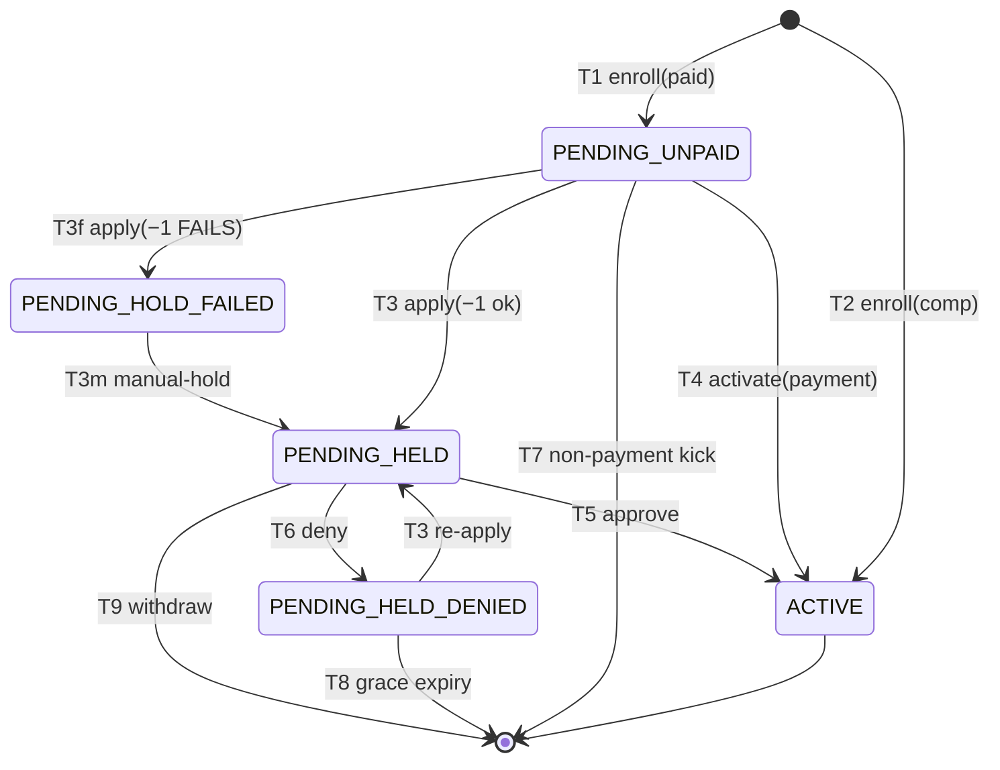

<!-- GENERATED — do not edit by hand.
     Source: the machine module’s exported TRANSITIONS, via src/lib/lifecycle/machineSpecs.ts.
     Regenerate: npm run generate:lifecycle-artifacts
     Drift-checked by src/lib/lifecycle/__tests__/artifactsDrift.test.ts. -->

# ProgramParticipant enrollment — lifecycle artifacts

Generated from the machine’s `TRANSITIONS` (LIFECYCLE_ARCHITECTURE §6.1). Do not hand-edit.

## State diagram

## Coverage matrix (state × event → target)

A blank (`—`) cell is a **deliberate** absent edge — a decision to ratify, not an oversight.

| state ╲ event | T1 enroll(paid) | T2 enroll(comp) | T3 apply(−1 ok) | T3 re-apply | T3f apply(−1 FAILS) | T3m manual-hold | T4 activate(payment) | T5 approve | T6 deny | T7 non-payment kick | T8 grace expiry | T9 withdraw |
| --- | --- | --- | --- | --- | --- | --- | --- | --- | --- | --- | --- | --- |
| UNENROLLED | PENDING_UNPAID | ACTIVE | — | — | — | — | — | — | — | — | — | — |
| PENDING_UNPAID | — | — | PENDING_HELD | — | PENDING_HOLD_FAILED | — | ACTIVE | — | — | UNENROLLED | — | — |
| PENDING_HOLD_FAILED | — | — | — | — | — | PENDING_HELD | — | — | — | — | — | — |
| PENDING_HELD | — | — | — | — | — | — | — | ACTIVE | PENDING_HELD_DENIED | — | — | UNENROLLED |
| PENDING_HELD_DENIED | — | — | — | PENDING_HELD | — | — | — | — | — | — | UNENROLLED | — |
| ACTIVE | — | — | — | — | — | — | — | — | — | — | — | — |

## Reachability

- **Initial:** UNENROLLED
- **Reachable (6):** ACTIVE, PENDING_HELD, PENDING_HELD_DENIED, PENDING_HOLD_FAILED, PENDING_UNPAID, UNENROLLED
- **Terminal (no outbound edge):** ACTIVE
- **Accepting terminals:** ACTIVE
- **Dead-ends (reachable terminal, not accepting):** (none)
- **Unreachable (declared but no legal path from ∅):** (none)
