<!-- GENERATED — do not edit by hand.
     Source: the machine module’s exported TRANSITIONS, via src/lib/lifecycle/machineSpecs.ts.
     Regenerate: npm run generate:lifecycle-artifacts
     Drift-checked by src/lib/lifecycle/__tests__/artifactsDrift.test.ts. -->

# OrgMembershipProcess — lifecycle artifacts

Generated from the machine’s `TRANSITIONS`. Do not hand-edit.

## State diagram

```mermaid
stateDiagram-v2
    ARCHIVED --> BLOCKED: unarchiveApplication
    ARCHIVED --> INTAKE: unarchiveApplication
    ARCHIVED --> PENDING_BG_CLEARANCE: unarchiveApplication
    ARCHIVED --> PENDING_BG_REVIEW: unarchiveApplication
    ARCHIVED --> PENDING_EXTERNAL_ACTION: unarchiveApplication
    ARCHIVED --> PENDING_PAYMENT: unarchiveApplication
    ARCHIVED --> PENDING_RENEWAL: unarchiveApplication
    BLOCKED --> ACTIVE: overrideBlocked approve
    BLOCKED --> ARCHIVED: archiveApplication
    BLOCKED --> PENDING_BG_CLEARANCE: overrideBlocked reset
    BLOCKED --> PENDING_BG_REVIEW: overrideBlocked reset · PERSON_BG
    BLOCKED --> PENDING_EXTERNAL_ACTION: overrideBlocked reset · RENEWAL · legacy
    BLOCKED --> PENDING_PAYMENT: overrideBlocked reset
    INTAKE --> ARCHIVED: archiveApplication
    INTAKE --> PENDING_EXTERNAL_ACTION: submitIntake · INITIAL
    PENDING_BG_CLEARANCE --> ACTIVE: clearBackgroundCheck
    PENDING_BG_CLEARANCE --> ARCHIVED: archiveApplication
    PENDING_BG_CLEARANCE --> BLOCKED: attest REJECT
    PENDING_BG_REVIEW --> ACTIVE: clearBackgroundCheck
    PENDING_BG_REVIEW --> ARCHIVED: archiveApplication
    PENDING_BG_REVIEW --> BLOCKED: attest REJECT
    PENDING_BG_REVIEW --> PENDING_PAYMENT: clearBackgroundCheck · legacy
    PENDING_EXTERNAL_ACTION --> ACTIVE: markContractSigned · PERSON_AGREEMENT
    PENDING_EXTERNAL_ACTION --> ARCHIVED: archiveApplication
    PENDING_EXTERNAL_ACTION --> PENDING_PAYMENT: advanceExternalIfComplete
    PENDING_PAYMENT --> ACTIVE: activate
    PENDING_PAYMENT --> ACTIVE: grantRenewalPayment · RENEWAL
    PENDING_PAYMENT --> ARCHIVED: archiveApplication
    PENDING_PAYMENT --> BLOCKED: attest REJECT
    PENDING_PAYMENT --> PENDING_BG_CLEARANCE: activate
    PENDING_RENEWAL --> ARCHIVED: archiveApplication
    PENDING_RENEWAL --> PENDING_EXTERNAL_ACTION: beginRenewal · RENEWAL
    [*] --> INTAKE: startIntake · INITIAL
    [*] --> PENDING_BG_REVIEW: personBgTriggers · PERSON_BG
    [*] --> PENDING_EXTERNAL_ACTION: personAgreementTriggers · PERSON_AGREEMENT
    [*] --> PENDING_RENEWAL: createRenewalProcess · RENEWAL
    ACTIVE --> [*]
    ARCHIVED --> [*]
```

## Coverage matrix (state × event → target)

A blank (`—`) cell is a **deliberate** absent edge — a decision to ratify, not an oversight.

| state ╲ event | activate | advanceExternalIfComplete | archiveApplication | attest REJECT | beginRenewal | clearBackgroundCheck | createRenewalProcess | grantRenewalPayment | markContractSigned | overrideBlocked approve | overrideBlocked reset | personAgreementTriggers | personBgTriggers | startIntake | submitIntake | unarchiveApplication |
| --- | --- | --- | --- | --- | --- | --- | --- | --- | --- | --- | --- | --- | --- | --- | --- | --- |
| ∅ | — | — | — | — | — | — | PENDING_RENEWAL | — | — | — | — | PENDING_EXTERNAL_ACTION | PENDING_BG_REVIEW | INTAKE | — | — |
| INTAKE | — | — | ARCHIVED | — | — | — | — | — | — | — | — | — | — | — | PENDING_EXTERNAL_ACTION | — |
| PENDING_EXTERNAL_ACTION | — | PENDING_PAYMENT | ARCHIVED | — | — | — | — | — | ACTIVE | — | — | — | — | — | — | — |
| PENDING_BG_REVIEW | — | — | ARCHIVED | BLOCKED | — | ACTIVE, PENDING_PAYMENT | — | — | — | — | — | — | — | — | — | — |
| PENDING_PAYMENT | ACTIVE, PENDING_BG_CLEARANCE | — | ARCHIVED | BLOCKED | — | — | — | ACTIVE | — | — | — | — | — | — | — | — |
| PENDING_BG_CLEARANCE | — | — | ARCHIVED | BLOCKED | — | ACTIVE | — | — | — | — | — | — | — | — | — | — |
| ACTIVE | — | — | — | — | — | — | — | — | — | — | — | — | — | — | — | — |
| BLOCKED | — | — | ARCHIVED | — | — | — | — | — | — | ACTIVE | PENDING_BG_CLEARANCE, PENDING_BG_REVIEW, PENDING_EXTERNAL_ACTION, PENDING_PAYMENT | — | — | — | — | — |
| PENDING_RENEWAL | — | — | ARCHIVED | — | PENDING_EXTERNAL_ACTION | — | — | — | — | — | — | — | — | — | — | — |
| RENEWAL_PENDING_BG | — | — | — | — | — | — | — | — | — | — | — | — | — | — | — | — |
| ARCHIVED | — | — | — | — | — | — | — | — | — | — | — | — | — | — | — | BLOCKED, INTAKE, PENDING_BG_CLEARANCE, PENDING_BG_REVIEW, PENDING_EXTERNAL_ACTION, PENDING_PAYMENT, PENDING_RENEWAL |

## Reachability

- **Initial:** INTAKE, PENDING_BG_REVIEW, PENDING_RENEWAL
- **Reachable (9):** ACTIVE, ARCHIVED, BLOCKED, INTAKE, PENDING_BG_CLEARANCE, PENDING_BG_REVIEW, PENDING_EXTERNAL_ACTION, PENDING_PAYMENT, PENDING_RENEWAL
- **Terminal (no outbound edge):** ACTIVE, RENEWAL_PENDING_BG
- **Accepting (designated resting states):** ACTIVE, ARCHIVED
- **Dead-ends (reachable terminal, not accepting):** (none)
- **Unreachable (declared but no legal path from ∅):** RENEWAL_PENDING_BG
