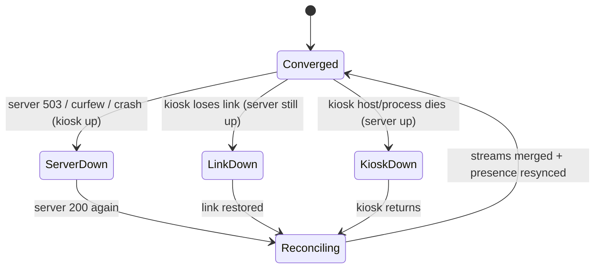
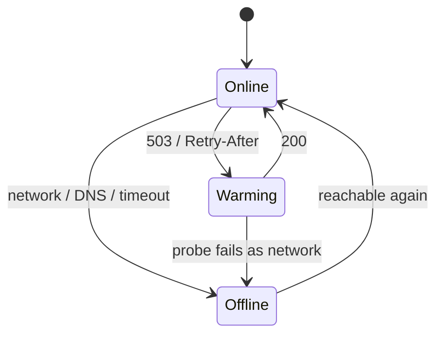
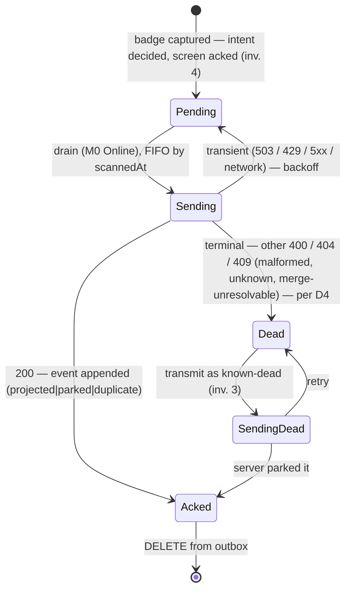
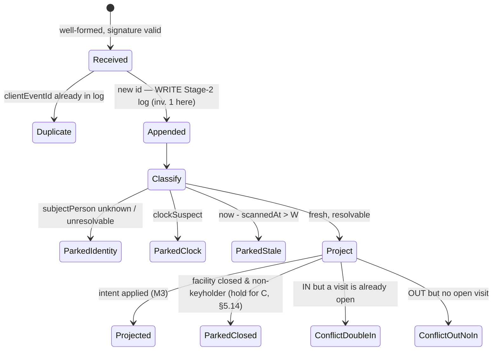
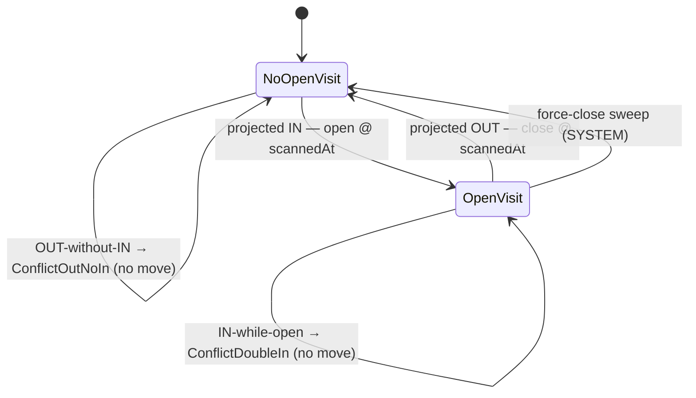

# Kiosk resilience: offline scan queue + network health & auto-recovery — v4

**Status: §0 and §5.1–22 ratified (2026-08-17). Nothing here is built.**
Companion to the kiosk client in `client/` and the scan path in `checkin-app`.
Written after a verified recon of both repos (2026-07-22, origin/main); every
claim about current behavior below was checked against the tree — symbols are
greppable, no file:line links. §5.23–27 (v3 audit residuals) are still open.

## What changed in v4

Ratification of §0 and of §5 questions 1–22 (discussion #1598 / issue #1347).
The five invariants are no longer proposed. Closed-facility authority is no
longer contested. Remaining open work in §5 is the v3 audit set (23–27) plus
implementation residuals named under a decided question (token lifetime,
corruption-redundancy mechanism, Q21 enumeration of C).

- **§0 is binding.** Dropped the "proposed (Tom) / not yet team-ratified"
  banner. A design choice that violates an invariant is inconsistent with
  this document.
- **Closed is advisory (§2, Q2, Q14).** The kiosk may open locally and
  propagate when the server is reachable. Server projection of
  accepted-while-closed scans is **C**: hold until a keyholder Visit exists,
  then auto-project in `scannedAt` order.
- **Happened-at order.** Later-arriving transactions apply in the order they
  occurred, not the order they were delivered.
- **Phase 1 includes the Stage-2 substrate (Q22).** No Phase 1.5. #254 lands
  later, not as a Phase 1 gate.
- **§5.1–22 rewritten as decided.** Working-answer / contested language
  removed. §5.23–27 unchanged except §5.26 (updated for Q14=C) and §5.27's
  cache constraint (identity cache may include users, roles, and badge
  numbers; youth/two-deep math stays server-side).

## What changed in v3

v3 folds in the Class-B audit register (#1529). Five findings land on paths
this proposal depends on; two of them contradict claims v2 made. The queue
(§2), health machine (§3) and reconciliation model (§6) are unchanged in
shape — what changes is which questions are still open.

- **The force-close confirm claim is withdrawn (§2 D3, §5.23).** v2 said a
  queued warning+confirm pair "keeps its original spacing, so the confirm
  semantics survive delivery lag." B2 shows the spacing detector cannot tell a
  confirm from an ordinary double-tap even *live*, so there are no semantics
  there to survive. §5.16's third option — explicit server-side confirm
  state — is now forced rather than one of three, and it gates Phase 1.
- **Absence-read-as-safe is a cross-cutting hazard (§5.24, §5.27).** B5, B6
  and B9 are one defect class, and invariant 2 makes their trigger the normal
  operating mode rather than a rare blip — §3.2's recovery ladder *causes* it
  on purpose. The safety display owes a third state, *roster known
  incomplete*, that today renders identically to "compliant".
- **The register already answers who may mint presence (§5.26, §7).** The rule
  B4 contradicts is this proposal's invariant 5 in other words. §7 records why
  resolving a parked scan is legal under it and a manual open backfill is not.
- **§7 (new)** — audit-register cross-reference: each finding, where it
  touches this design, which question carries it.
- **Phase gates (§4).** Three findings must resolve before the phase that
  would otherwise ship on top of them.

## What changed in v2

v2 is a refinement pass over the v1 proposal (offline queue + health/recovery).
The queue (§2) and health machine (§3) are largely unchanged; the new material
is the invariants that now govern everything and a full reconciliation model.

- **§0 Invariants (new).** Five invariants that bind the rest:
  (1) never lose a scan, (2) infra failure is normal, (3) nothing "normal"
  requires a kiosk login, (4) always acknowledge the person's badge, (5) trust
  the displayed direction. Ratified in v4.
- **§6 Reconciliation (new).** The whole "offline events → visits" model:
  the 4-stage pipeline, the **unified Stage-2 substrate** (every surface emits
  intent-carrying events; Visits *project* from one append-only log,
  re-runnably), the three outcomes (**auto / park-hinted / park-unhinted**,
  where a hint *is* a best-effort provisional projection), the system-partition
  states (Converged / ServerDown / LinkDown / KioskDown / Reconciling) and
  their reconnection edges, the per-event machines M0–M3, and the
  concurrent-authority conflict catalog.
- **Direction is captured at the edge, not re-inferred (invariant 5 + §6.1).**
  The biggest correctness change: the queued event carries the in/out intent
  the kiosk displayed; the server never re-toggles from live state at delivery
  (which silently flipped a replayed check-in into a check-out in v1's implicit
  model).
- **Closed-facility authority (§2) and §5.** v2 left these contested. v4
  settles them: advisory local-open (Q2), deferred projection C (Q14),
  substrate with Phase 1 (Q22).

## 0. Invariants — ratified 2026-08-17

These bind the rest of the document. A design choice that violates one is
inconsistent with this document. Nothing here is built.

1. **Never lose a scan.** A badge touch, once read, must survive to
   a durable record — client outbox until the server acks a `RawBadgeLog`
   row — regardless of staleness, facility state, or any assumed safety
   violation. We may decline to *display* or *project* a scan (park, flag,
   defer); none is ever lost. **Exception:** a scan falling inside the
   double-badge debounce window may be ignored outright, live or replayed —
   it is a duplicate of a touch already durably recorded, not a lost scan.
   Force-close confirm is **not** inferred from that window (§5.16, §5.23):
   it is an explicit state with a visible countdown; the next scan ends the
   countdown and exits the state. Residual debounce width (noise only) is
   an implementation default.
2. **Infra failure is normal, not an incident.** WiFi loss —
   potentially for **hours at a time** — is an expected operating mode. The
   kiosk must keep accepting scans, keep its display honest, and recover
   unattended through it; nothing in the design may treat a long outage as
   an exceptional path that degrades into data loss or manual intervention.
3. **Nothing "normal" requires logging into the kiosk.** A 24h WiFi outage is
   "normal" under invariant 2. Every normal outcome — including events that
   land in the dead-letter queue — must eventually be visible and resolvable
   **server-side**: DLQ'd events are transmitted on the same `POST /api/scan`
   as live scans (`dead: true`; §5.10). The kiosk's local corner count is a
   signal, never the only copy ops can reach.
4. **Always acknowledge the person's assertion.** When
   someone badges, the kiosk must tell them "we got it — you're checked
   in/out", even when the server's math currently disagrees (e.g. it thinks
   the facility is closed) or the network is down. Refusing to acknowledge a
   good-faith badge is a **customer-service failure**, not a correctness
   win. The kiosk may *also* surface "kiosk not fully communicating" so
   people can see there may be sync issues — but that is additive, never a
   substitute for the acknowledgement. Every design choice below must
   preserve this: server-side projection timing may vary, the at-the-door
   acknowledgement may not.
5. **Trust the displayed direction.** The kiosk shows the
   human "checked **in**" / "checked **out**" and the human acts on it. That
   displayed direction is the intent of record — the server must not re-infer
   in/out from its own live state at delivery time (which, for anything not
   live, silently flips a replayed check-in into a check-out). Direction is
   captured at the edge, from what the person saw, and carried with the
   event; reconciliation consumes it, never overrides it by re-toggling. Concretely
   this means the queued event carries its own in/out intent, rather than the
   server deciding direction from live state when the event finally lands.

## 1. Why the kiosk "goes down", verified

The kiosk is a Python Ed25519-signing proxy (`client.py`, localhost-only) with
Chromium in `--kiosk` mode rendering a wrapper that iframes
`/attendance/current?mode=kiosk`; USB badge scans become signed
`POST /api/scan`. Today `post_scan` catches every exception, paints a red
"Scan failed" banner, and **drops the scan — no retry, no queue, no
persistence**. The verified outage shapes:

- **Scale-to-zero cold wake (the headline).** Prod tears down to
  `desiredCount=0` overnight (soft curfew) and wakes on intent. A scan `POST`
  IS the waking intent — but its own response is the waker's `503
  WARMING_HTML` page; `post_scan` calls `r.json()` on HTML, throws, and the
  scan is lost. **The first scan after any idle teardown is guaranteed lost
  today**, with a red banner that reads as "broken" instead of "warming".
- **Aurora auto-pause** (`min_capacity=0`, 5-min pause). Mostly absorbed
  server-side by `auroraResumeRetry` (45s connection-acquisition deadline);
  scans past the deadline drop.
- **Genuine network loss** (WiFi/DNS/upstream): every scan drops for the
  duration; the failure layer is invisible to staff.
- **Silent scanner death**: `usb_scanner_listener`'s `read_loop()` has no
  re-grab guard — an unplugged/renamed USB scanner kills the thread with zero
  surface.
- **Two dead self-heal paths on main**: the version poller fetches
  `origin/master` (doesn't exist) and polls `/api/kiosk/version` (404; the
  real route is `/api/system-status/kiosk-version`), so the auto-update
  restart and server-version reload never fire. `config.example.json`'s
  `kiosk_path` points at `/kioskdisplay` which 404s (real page:
  `/attendance/current?mode=kiosk`).
- **No heartbeat**: outages are discovered by walking up to the door.
  `DbWakeNotice` is session-gated and therefore inert on the signature-authed
  kiosk.

One server-side fact shapes the whole queue design: `/api/scan`'s dedup is a
**3-second time-debounce** against `RawBadgeLog` (which has **no unique
key**), and the check-in/out direction is a **live-state toggle** — so a
delayed re-delivery of a lost scan doesn't dedup, it **toggles the person
back out**. Retry without a real idempotency key is worse than the disease.

## 2. Offline scan queue

Design forces beyond §1, all verified: the client process restarts routinely
— self-update `os._exit(0)` (once §3.3 revives it) through the `kiosk.sh`
respawn loop, and these are Pis that lose power (in-memory
anything dies; storage must be crash-consistent); the toggle direction is
inferred from live state under a per-participant `pg_advisory_xact_lock` and
that inference is only valid at scan time; one facility shares one NAT IP
against the 300/min scan rate limit (counted before crypto in `withKiosk`);
and `findAssociatedEventAt` binds a visit to an Event **by time**, so replay
must carry the original scan time or the visit lands under the wrong Event.

Everything below is bound by the §0 invariants — in particular invariant 1
(never lose a scan) and invariant 3 (dead-lettered events must eventually
reach a server-side DLQ).

### Decisions

**D1 — Queue storage: SQLite via stdlib `sqlite3`.** One file, one table, WAL +
`synchronous=FULL`. Stdlib (no new Pi dependency) and it provides what a
hand-rolled log would make us write: ACID durability across the respawn loop,
crash-consistency on power-cut (a torn write rolls back), DELETE-by-id on ack,
and a UNIQUE column for dedup. Corruption knob: on open, a `DatabaseError`
means rename the file aside (`outbox.corrupt.<ts>`) and start fresh —
**scanning must never block on a sick queue.** Volume is a handful of human
scans; favor durability over speed.

Outbox schema (client): `outbox(client_event_id TEXT PRIMARY KEY,
participant_id INT, scanned_at TEXT, attempts INT DEFAULT 0, last_status INT,
state TEXT DEFAULT 'pending', created_at TEXT)` — `state ∈ {pending, dead}`.

**D2 — Event identity: client UUID + scan-time timestamp; server dedups on a
nullable unique column.** The client generates `clientEventId` (UUID) and
captures `scannedAt` at the moment the badge is read, and reuses both across
every retry. Server-side dedup is `@unique` on `RawBadgeLog.clientEventId`,
**nullable** so legacy/web writers keep writing NULL (Postgres NULLs don't
collide) — un-upgraded kiosks and web check-ins are unaffected. New writers
get exactly-once semantics: a redelivered event hits the pre-read and no-ops.

**D3 — Stale-replay: record the touch always; toggle only within a freshness
window; park the rest for a human.** The honest finding: **no fully-automatic
scheme is safe** for a stale scan — a bare toggle cannot tell "badge to enter"
from "badge to leave"; it leans on live state, which is exactly what is stale.
Split by freshness:

- **Always** write the `RawBadgeLog` row with `clientEventId` and
  `timestamp = scannedAt` (the true event time). The touch is never lost and
  event-association stays correct even when we decline to project a Visit.
- **Within window W** (config, default ~10 min — comfortably exceeds the
  worst-case ~3–5 min cold wake): apply the normal toggle at delivery via the
  existing `processCheckin`/`processCheckout`, passing `scannedAt` as the
  visit time. One **out-of-order guard**: if the participant has any visit
  activity (arrival or departure) newer than `scannedAt`, park instead of
  toggling — state has moved past the event, and applying it could otherwise
  write a Visit with `departedAt < arrivedAt` or resurrect a closed visit.
  This covers the waker and Aurora outages — the events we most
  need not to lose — and reuses the advisory lock, the partial unique index
  (`Visit_one_open_per_participant`), and the facility-close path unchanged.
- **Beyond W**: do **not** touch `Visit`. Record the log row, set
  `reviewReason`, surface in the ops panel (D7) for a human. `200
  {type:"parked"}`.

Interplay with the 3s debounce: a replayed row's past `timestamp` never
suppresses later live scans, but the debounce read at *delivery* time
(`timestamp >= now-3000ms`, by person) can match a live scan that landed just
before the replay — the replay then returns `ignored_debounce`, which the
client acks (rare: the touch row is swallowed, but the live scan already set
the state; honest cost of keeping double-badge protection — allowed under
invariant 1's debounce exception (§0)). `clientEventId`
is the real dedup, pre-read **inside** the advisory-lock transaction
(mirroring the debounce pre-read shape) so there is no TOCTOU against a
racing replay of the same event; the `@unique` constraint is the backstop —
any pre-read race that slips through (e.g. two kiosks replaying one event
across *different* advisory locks after a mid-replay merge changed the
survivor) surfaces as P2002, which the server maps to `200
duplicate_ignored`. One more `timestamp` consumer, and v2 got it wrong: the
last-keyholder force-close detector (top-2 `RawBadgeLog` rows within 12s)
compares scan times after replay, which v2 read as the confirm semantics
surviving delivery lag. They do not survive, because they do not hold live
either — **audit B2 (#1529)**: nothing ties those two rows to a warning having
been displayed, so an ordinary double-tap seven seconds after a keyholder's
check-in force-closes the building over the people standing in it. Replay only
makes it unattended — a queued double-tap pair replays with its spacing
intact and fires at delivery with nobody at the kiosk, and `closeAllOpenVisits`
stamps `departedAt = now` rather than `scannedAt`. D3 bounds this without
removing it: pairs landing beyond W park, and the drain sleeps through the
closed window, so the exposure is outages shorter than W. **Forced
consequence:** the confirm becomes explicit server-side state before replay
ships (§5.23), and until it is, a replayed scan must never be able to set
`confirmForceClose`.
Parked events don't write Visit, so they can't violate the partial index.
Multi-kiosk, one person: the advisory lock serializes replay-vs-live and
kiosk-vs-kiosk, and the out-of-order guard makes the newest `scannedAt` win —
an older event arriving after it parks for review instead of overwriting
(sign-off: open question 4 — per Tom, fleet is one kiosk; this paragraph is
robustness, not a requirement). Residual misorderings are rare and
self-correcting (staff see the roster; the person re-badges). We explicitly
do not build cross-kiosk ordering consensus for a makerspace door.

**D4 — Replay transport: single FIFO-by-time thread, re-sign per attempt,
waker-aligned backoff, one-at-a-time first.** One drain thread pulls
`state='pending'` in `scanned_at` order — global-time FIFO trivially preserves
per-person order. Re-signing every attempt is forced by the 60s signature
window and free (the key lives on the Pi). The client stops calling
`r.json()` blind and branches:

| Server says | Client does |
|---|---|
| `2xx` JSON `{type: checkin\|checkout\|duplicate_ignored\|ignored_debounce\|parked}` | **ack** — DELETE from outbox |
| `503` / non-JSON body / `Retry-After` present | **warming, not failure** — keep; sleep `max(Retry-After≈30s, backoff)`; §3.5's ~10-min cap reclassifies a stuck "warming" |
| `429` | backoff, respect `Retry-After` |
| `400` JSON `{type:"warning"}` | **ack** — the last-keyholder force-close caution; the touch row WAS recorded server-side. "The confirm badge is its own queued event" holds only while the confirm is inferred from spacing; under §5.23's explicit confirm state a queued confirm carries a token minted before the outage and must be treated as expired, not honored |
| other `400` / `404` / `409` | **terminal** — `state='dead'`, escalate (D6/D7) |
| `401` | retry + escalate to the warning banner — clock skew (NTP) or key mismatch; **never** dead-letter, re-signing succeeds once the clock/key recovers |
| other `5xx` | retry with backoff — handler threw, transaction rolled back, idempotent |
| status 0 (network/timeout) | retry with backoff — safe, idempotent |

Backoff: start at the waker's `Retry-After: 30`, exponential to ~5 min cap,
jittered. Drain pace is capped at ~1 event/sec (proposed, Tom) so a long backlog
leaves ≥240/min of the shared 300/min scan limit to live scans. **The drain sleeps through the closed window**: a queued `POST` is a
non-GET (it would wake the curfewed service) and steady retries defer the soft
curfew's 5-min quiet check — the §3.4 trap twice over. Events held overnight
land beyond W and park for morning review, which is the right outcome. On
startup (including after the nightly reboot — the WAL survives) the drain
begins by reading existing `pending` rows. **Try-first,
enqueue-on-non-confirmation** (not write-ahead):
generate `clientEventId` before the first attempt; persist to the outbox only
if the attempt isn't confirmed — **unless the outbox already holds a pending
event for the same participant, in which case enqueue behind it instead**: a
fresh scan must not jump its own predecessor, or the drain later applies the
older toggle on top of the newer one (order inversion; D3's server-side guard
is the backstop). The idempotency key makes at-least-once
delivery harmless, so the happy path skips an INSERT+DELETE per scan.
`ponytail:` the only gap is a crash in the milliseconds between a failed send
and the enqueue — closeable later with write-ahead at the cost of a DELETE per
scan.

**D5 — UX: a fourth banner state that reads as *safe*.** Green ok / red error /
amber warning exist today, and amber is already the keyholder force-close
caution. A queued scan must read as **done and safe to walk away from**: a
distinct **blue "Saved" banner** with a check-mark — `✓ Saved — will sync
(N waiting)`. The check-mark on green and blue is the "safe" signal; **red is
the only "not saved" state.** A live queued-count rides the SSE stream so
staff watch the backlog drain. Two honest caveats: a blue scan is not yet on
the live roster/count (the display catches up on sync), and permanent
failures can't re-alert a person who already left — those escalate to the ops
panel, not the banner.

**D6 — Failure budget: keep accepting, always.** Refusing a scan during an
outage turns people away at the door — the opposite of resilience. A queued
event is ~100 bytes; a full day offline is kilobytes on a Pi with gigabytes.
The outbox holds only un-acked events, so it is near-empty except mid-outage;
a large size cap (~50k rows) is a guard rail against a pathological stuck
state, and un-acked rows are **never** silently evicted. Events that can
never apply (unknown `participantId` after a merge → 404/409; malformed →
400) are dead-lettered: `state='dead'` stops them burning rate limit and
blocking FIFO; the badge needed reissuing anyway. Invariant 3: dead rows are
not allowed to strand on the Pi — they must eventually transmit to a
server-side DLQ (mechanism/phase open — §5, question 10).

**D7 — Parked & dead events live on the existing `system-status` panel,
backed by two columns on `RawBadgeLog`.** No new table: a parked event IS a
badge-log row we chose not to project. `reviewReason` (set at park/dead time)
and `reviewedAt`/`reviewedBy` (set on resolution) hang on the row we're
already extending. A `system-status/unsynced-scans` sub-page — same
`withAuth({roles:['isSysadmin','isBoardMember']})` pattern as
`system-status/errors` — lists unresolved rows: "Person X, scanned 2:14pm,
40 min late — [Check in] [Dismiss]." A small "⚠ N need review" count on the
kiosk corner signals accumulation without a keyboard.

**That corner count invites a login at the kiosk, and a login de-minimizes the
screen (audit B9).** `GET /api/attendance` reduces the roster — no
`dateOfBirth`, no phone, no emergency contacts — only when `isKiosk`, which is
true only when the kiosk signature verifies. A keyholder who signs in on the
kiosk browser is a *session* caller, so the same unattended public-room screen
serves the full payload. Today that requires someone to think of it; the count
above is designed to make it the workflow. Minimization must key on the
surface rather than on which credential authenticated (§5.25) before the count
ships.

**Resolution semantics — decided (2026-08-17).** The review surface is for
**keyholders and ops**, superseding the `['isSysadmin','isBoardMember']`
framing above (role-flag mapping is `isKeyholder || isOperations ||
isBoardMember || isSysadmin` — §5, question 15). Resolving writes the Visit
at `scannedAt`, never resolution time — resolution can be days later.
Resolved visits are **normal visits**: volunteer-hour derivation and
attendance reports consume them unchanged (infrastructure hiccup, not a
different kind of visit). Next-day resolution with no matching scan-out
applies the close-sweep-equivalent departure, and that synthesized departure
itself enters the review queue for confirmation. Decided (§5, question 13):
retroactively correcting a sweep-closure that a late-arriving (parked/dead)
checkout should have preempted — the sweep stamped `departedAt=closeTime` but
the person actually left at `scannedAt` — is **human always**; nothing
rewrites a sweep departure to `scannedAt` automatically.

**Open-visit staleness bound (from audit B4).** `attendance/manual` refuses an
open backfill whose arrival is older than same-day-or-6h, and states the
reason in the route: a stale arrival with no departure creates a permanent
open visit nobody scanned out of. Resolution here has no equivalent bound.
Next-day resolution closes via the sweep-equivalent departure, but a same-day
resolution of an IN whose OUT never arrived mints exactly that permanent open
visit. One hazard, two guards, one of them missing (§5.26).

### Extended `/api/scan` contract (backward-compatible)

```
POST /api/scan                       Auth unchanged (withKiosk; re-sign every attempt)
Body (new fields optional):
  { participantId: number,
    clientEventId?: string,          // UUID, stable across retries of one scan
    scannedAt?:     string }         // ISO8601, instant the badge was read

Server:
  legacy body {participantId}        → exactly today's behavior (timestamp=now, no dedup key)
  clientEventId present → in the advisory-lock tx, pre-read RawBadgeLog by clientEventId:
    found  → 200 {type:"duplicate_ignored"}                    (idempotent replay, no toggle)
    absent → write RawBadgeLog{clientEventId, timestamp: scannedAt ?? now}:
      (now - scannedAt) <= W → normal toggle, event-assoc uses scannedAt
                               → 200 {type:"checkin"|"checkout"}
                               out-of-order guard (D3): participant has visit
                               activity newer than scannedAt → park instead
      else                   → set reviewReason, DO NOT toggle → 200 {type:"parked"}
  unique-violation on the insert (cross-lock race, e.g. mid-replay merge)
                                     → 200 {type:"duplicate_ignored"}
```

### Schema delta

```prisma
model RawBadgeLog {
  // …existing…
  clientEventId String?   @unique   // idempotency key; NULL for legacy/web writers
  reviewReason  String?             // set when a stale/dead replay is parked instead of toggled
  reviewedAt    DateTime?           // set when a human resolves it in system-status
  reviewedBy    Int?                // resolver personId
  // timestamp carries the ORIGINAL scannedAt for replayed events (previously always now())
}
```

**Versioning (proposed, Tom).** The *initial* rollout is
manually sequenced (server deploys before the client change merges — Phase 0
revives auto-update, so this ordering is live from day one). *Ongoing*, the
contract is explicit, never inferred: the body carries `protocolVersion`,
validated server-side with a zod schema, and the server advertises its
supported scan-protocol version in the public
`/api/system-status/kiosk-version` payload the client already polls. The
client enables replay / new-field behavior only when the advertised version
covers it — an auto-updating kiosk can never race a not-yet-deployed server
into undeduplicated retries.

Create the unique index `CONCURRENTLY` in a raw-SQL migration (can't run in a
transaction; would otherwise lock the table) — the hand-written-migration
precedent set by `Visit_one_open_per_participant`.

### Rejected alternatives (tombstones)

- **Append-only JSONL outbox** — hand-rolls compaction, dedup, read-cursor,
  torn-last-line handling, cross-thread locking; SQLite gives all of it from
  stdlib.
- **Redis / queue daemon on the Pi** — a whole service for a handful of rows.
- **Write-ahead every scan** — the idempotency key already makes at-least-once
  harmless; named as the upgrade path for the millisecond crash window.
- **Full event-sourcing (recompute Visits from RawBadgeLog)** — fights the
  imperative toggle, the partial unique index, the facility-close sweep, and
  notifications; and a bare toggle still can't resolve two same-direction
  scans. Not worth rebuilding the projection engine for a door.
- **Precondition replay on kiosk-observed state** — the kiosk doesn't reliably
  know the state; the confirming response is exactly the one that never
  arrived.
- **Dead-letter everything stale** — a 40-min-old scan is usually still
  correct; blanket dead-lettering discards real attendance.
- **A dedicated ParkedScan/SyncFollowUp table** — two nullable columns on the
  row we're already extending + the existing panel cover it.
- **Per-person parallel replay** — a Pi drains a trickle; single FIFO-by-time
  preserves order with one thread and one cursor.
- **Heartbeat as DLQ carrier** — rejected (2026-07-23): a heartbeat is a
  heartbeat, not a DLQ device; dead events travel as explicit known-dead
  submissions (§5, question 10).

### Closed-facility authority — decided (advisory, 2026-08-17)

Facility-open is **advisory**. The kiosk may **open locally** when the
requirements are met (a keyholder badge in the local cache), even without the
server, and **propagate that state** when the connection returns. The live
403 is off the table (invariant 4: the person was already acknowledged).

Server-side projection of those events is **C** (§5.14): hold until a
keyholder Visit exists, then auto-project in `scannedAt` order. No human on
the happy path. No zero-keyholder roster.

The Pi caches **users, roles, and badge numbers** — not keyholder standing
alone — so "can this badge open?" is a local lookup (§5.11). Youth and
two-deep math stay server-side (§5.27).

A signed scan at delivery is enough liveness; no extra heartbeat requirement
to accept advisory events (§5.12). After a cold start, expect a short drain;
the banner reads `syncing (N)…`, not "broken."

This changes the live gate (CUJ A7.1), not only the replay path.

### Outage staleness & reconciliation — ratified

**(a)** During an outage, server-side safety displays (two-deep, roster,
counts) are stale by construction; the physical room and the kiosk-local
screen are the source of truth until the queue drains — the design does not
pretend otherwise. **(b)** A constraint on future two-deep *enforcement*
(#300): a replayed departure is fait accompli — the person already physically
left; enforcement may record and flag it for review, never reject it
(rejecting would violate invariant 1). Residual (§5.21): enumerate C plus
the server-side events (web check-ins, manual visits, admin edits,
force-close sweeps) that occur during the same outage.

## 3. Health checking, recovery, and heartbeat

### 3.1 Layered health state machine

A single background thread (`health_monitor`, sibling to the existing
`attendance_poller`/`version_poller`) owns new state fields (`scanner_ok`,
`last_browser_seen`, `last_attendance_ok`, `net_layer`, `warming`). Layers are
diagnosed by **one cookieless `GET /api/health`** plus two local observations
— the probe's *failure mode* is the layer discriminator, so there is no probe
per layer:

| Layer | Signal | Failure looks like | Recovery trigger |
|---|---|---|---|
| L0 process | client.py alive | crash/exit | `kiosk.sh` loop respawn (rung 2 path) |
| L1 scanner | `dev.grab()` held; `read_loop()` iterating | silent today: unplug kills the thread, zero surface | re-grab (rung 0.5) + heartbeat flag |
| L2 LAN/gateway | default gateway reachable | probe `ConnectionError` AND gateway unreachable | wifi bounce (rung 3, gated) |
| L3 DNS | resolve the backend host | `gaierror`; gateway fine | wifi/NM restart (rung 3) |
| L4 TLS/TCP to ALB | :443 handshake | `ConnectTimeout`/`SSLError`; gateway+DNS fine → upstream, **not locally recoverable** | report only — never thrash wifi |
| L5 app | `/api/health` → 200 | `503`+`Retry-After` = **warming, not down**; other 5xx = app fault | warming → §3.5 banner; other 5xx → report only (upstream — a Pi reboot can't fix the app) |
| L6 DB | scan outcomes (real writes) | scans fail while L5=200 | observe from scans; **never steady-poll** |

**One probe, failure-mode routed.** `/api/health` is public, DB-free, and a
cookieless GET **does not wake** the scaled-to-zero service (the waker wakes
only on any-cookie or non-GET/HEAD). Not-waking is only half the curfew trap,
though: the soft curfew tears down only when the trailing 5 minutes are
request-quiet (`shutdown_min_idle_minutes = 5`, ALB RequestCount across BOTH
target groups — cookieless GETs count; only the ALB's own TG health checks
don't), so a steady sub-5-min poll keeps prod up all night — the 2026-07-17
monitor-as-keep-alive incident shape. `health_monitor` polls freely during
open hours (idle teardown is off) and goes **silent through the closed
window** — and so must ALL steady kiosk traffic: the **existing**
`attendance_poller` (30s signed GET, currently unconditional) alone would
defer every curfew attempt the moment a 24/7-powered kiosk points at prod,
so the closed-window gate covers it too.

**L6 is observed, not probed.** `/api/health/db` is session-gated by design
(an anonymous `SELECT 1` would let crawlers resume and pin the auto-pausing
Aurora). A `withKiosk`-signed analog (`GET /api/system-status/db-ping`) is
defined **as an on-demand diagnostic only, never a timer** — even a signed
steady poll would pin Aurora. Scans already exercise the DB; their outcomes
are the DB signal.

**L1 is the highest-value new signal**: wrap `read_loop()` in try/except; on
device loss set `scanner_ok=false`, re-run `find_device` + `grab()` with
capped backoff, surface on the heartbeat and a persistent warning banner.

### 3.2 Recovery ladder

| Rung | Action | Gate |
|---|---|---|
| 0 | SSE `{reload:true}` → iframe re-src | auto, ungated (existing path) |
| 0.5 | scanner re-grab | auto, ungated, backoff |
| 1 | bounce Chromium alone | auto, cooldown (≤1 / 5 min) |
| 2 | full `kiosk.sh` cycle | auto, cooldown (existing `os._exit(0)` path) |
| 3 | NetworkManager/wifi bounce | auto, **only on L2 gateway-unreachable or L3 DNS failure**; never on L4 |
| 4 | reboot | nightly (closed hours) + escalation (rate-limited 1/hr) |

**Hung-Chromium detection via the proxy's on-path view (rung 1).** Today the
browser is bounced only when the Python process exits; a renderer hang leaves
a frozen screen forever. But the proxy sees every request the browser makes —
the wrapper's SSE and the iframe's 60s `usePolling` → `/api/attendance`.
**Caveat found in review:** the page's never-idle-stop branch keys on
sig/ts/nonce URL params (`isSignedKiosk`), which the proxied wrapper never
passes — on the Pi the poll idle-stops after 10 input-less minutes, and a
kiosk browser gets no user input. Prerequisite for this rung: exempt the
kiosk display from idle-stop (key on `mode=kiosk` or the `signedRequest`
response flag), or every quiet night reads as a wedged browser. With that
fixed: `last_browser_seen` = last local-browser request; silence > ~150s
(2.5× the poll) with Python healthy = wedged browser.

**Extend `kiosk.sh`, don't migrate to systemd now.** To bounce Chromium alone,
nest its launch in an inner loop guarded by a sentinel file that `client.py`
writes on wedge-detect; `os._exit(0)` still forces the full outer cycle.
systemd (with its watchdog) is *permitted* — the README's warning is about
XDG autostart — but the fleet is hand-provisioned and `kiosk.sh` ships to
every Pi for free via its own `git pull origin main`; units would mean
touching each Pi by hand. Right target once a provisioning image exists; the
migration doesn't pay for itself yet.

**Wifi bounce is gated to the local plane (L2/L3).** Bouncing on L4
(gateway+DNS fine, upstream down) is thrash that can lose association and
make it worse.

**Nightly reboot is curfew-safe and rolls updates.** The post-boot startup
calls (git pull hits GitHub; attendance/version checks are cookieless GETs)
cannot wake the service; schedule it in the closed window clear of
the 06:45 prewarm. The outbox rides through — SQLite WAL + `synchronous=FULL`
is reboot-safe, and the drain re-reads `pending` rows at startup (D4). Clears kernel/USB/wifi-firmware wedges nothing else fixes,
and pulls the latest client via `kiosk.sh`. Escalation reboot (ladder
exhausted, still red) is rate-limited to 1/hr against boot-loops.

### 3.3 Ship-first dead-path fixes (independent of everything else)

1. `version_poller`: `origin/master` → **`origin/main`** (self-update restart
   currently never fires).
2. `get_server_version`: `/api/kiosk/version` → **`/api/system-status/kiosk-version`**
   — the merged, public, DB-free route already consumed by `SystemHealthPanels`.
   (Rejected: resurrecting the unmerged `feature/kiosk-auto-reboot` duplicate.)
3. `config.example.json` + the `kiosk_path` default in `client.py`:
   `/kioskdisplay?mode=kiosk` → **`/attendance/current?mode=kiosk`** (the
   committed example 404s on a fresh Pi).

### 3.4 Heartbeat — designed around the curfew + auto-pause trap

**The trap:** a heartbeat that is non-GET or cookie-bearing wakes the curfewed
service all night; one that writes the DB every N seconds keeps Aurora from
ever pausing. Both are money leaks.

**Liveness is free — reuse traffic the kiosk already sends.** `withKiosk`
verifies a signature on every kiosk request (scans and the Python
`attendance_poller`'s 30s signed poll — the browser's 60s poll idle-stops,
§3.2). Stamp an **in-memory** `lastSeenByKiosk` on every verified request:
zero new requests (cannot wake), zero DB writes (cannot pin). A new admin
`GET /api/system-status/kiosk-heartbeat` reads it into a "Kiosk last seen Xm
ago" panel on `SystemHealthPanels`. Only a verified kiosk signature updates
it (no anonymous forgery); the per-IP rate limit already caps it. Overnight
the value dies with the scaled-to-zero task and the panel correctly reads
stale-during-curfew — expected, not an alert. Single-task assumption is the
same one the nonce Map already makes; `ponytail:` multi-task needs the DB.
Under advisory mode (§2), this passive stamp is also the answer to "does the
server need a client heartbeat to trust advisory scans" — no new traffic, no
DB writes; **a signed scan at delivery is enough liveness** (§5, question 12).

**Clock trust (proposed, Tom — partial).** The kiosk clock is
trusted: a scan is trusted for **when it occurred, not when it was
transmitted** — `scannedAt` stands. The signature window already bounds
*transmit-time* skew (>60s skew → 401, the drain stalls, nothing lands on a
badly-skewed clock). The heartbeat carries assumptions of time: the
`X-Kiosk-State` payload includes the kiosk's clock reading so the server can
observe skew directly. Residual edge (§5, question 12): a clock wrong at
*scan* time but corrected before transmit yields a validly-signed,
wrongly-stamped `scannedAt`.

**Richer self-diagnosis (optional, default off):** a slow-cadence signed
cookieless GET carrying `X-Kiosk-State` (which layer is red, last-scan age);
downshifts to silent when the probe sees warming-503 and resumes on 200 —
and stays silent through the closed window (any sub-5-min cadence defers the
soft curfew's quiet check; see §3.1).

**Persistence only on state transition, only if alerting is wanted:** on
online↔offline edges write one `SystemMetricLog` row (`metric="kiosk_online"`)
— O(transitions) writes, Aurora still pauses. Default: no DB writes; add
write-on-change as the gated upgrade that active alerting (email via the
existing `sendEmail` path from a cron) would require.

### 3.5 Waker-aware display

On `503` / non-JSON / `Retry-After` from the backend, the proxy and
`post_scan` treat the response as **warming**: push an SSE warning banner
("Server waking (~1 min)…", the existing `banner-warning` style) instead of
red failure, then probe cookieless `/api/health` every ~5s (the holding
page's own refresh cadence) until 200 — the scan's own POST already issued
the wake; the probe just notices recovery fast. On flip to 200: clear banner,
push `{reload:true}`. The queue (§2) owns re-sending the scan itself.
**Warming has a clock**: past ~10 min (double the worst-case cold wake) stop
calling it warming — flip to the red failure banner and flag the heartbeat.
Without the cap, a never-healthy task or crash-looping deploy (the ALB demotes
to the waker page, which looks exactly like warming) reads as "waking (~1
min)" forever.

### 3.6 Wedged-display detection

`last_attendance_ok` = timestamp of the last successfully proxied
`/api/attendance` 200 (requires the §3.2 idle-stop exemption first — without
it the poll legitimately stops after 10 quiet minutes). Stale > ~180s (3× the
poll) while L2–L5 are green =
the iframe is wedged (JS crash, dead EventSource, hung renderer) → rung 0
reload; still stale → rung 1 Chromium bounce. The proxy sees all traffic, so
this needs no cooperation from the page.

**A rejected signature is not a wedge.** `last_attendance_ok` counts 200s
only, so a kiosk whose signature stops verifying — NTP drift past the 60s
window, key rotation — goes stale and climbs the ladder, and neither a reload
nor a Chromium bounce fixes a signature. Note the asymmetry with D4, which
treats `401` on the scan path as retry-forever-never-dead-letter: the same
failure blanks the display while the outbox keeps queueing happily. Treat a
persistent 401/403 on the proxied `/api/attendance` as its own health signal
(banner + heartbeat flag), not as rung-0 input.

### Rejected alternatives (tombstones)

- **Dedicated POST heartbeat** — non-GET wakes the service; defeats the curfew
  all night.
- **Heartbeat writing the DB per beat** — pins Aurora; the 5-min pause never
  arrives.
- **Anonymous (or steady signed) DB probe** — the exact abuse the
  `/api/health/db` session gate exists to prevent; even signed, a steady poll
  pins. On-demand only.
- **systemd migration now** — allowed but doesn't pay for itself on a
  hand-provisioned fleet; deferred to a provisioning image.
- **Resurrecting `feature/kiosk-auto-reboot`'s endpoint** — duplicates the
  merged, panel-backed `/api/system-status/kiosk-version`.
- **Wifi bounce on any backend failure** — upstream faults would thrash the
  radio; gated to the local plane (L2 gateway-unreachable / L3 DNS).
- **CloudWatch custom heartbeat metric** — extra plumbing for what the
  in-memory stamp + panel already show during open hours; deferred to
  overnight-alerting, if ever wanted.

## 4. Phased delivery

- **Phase 0 — the three dead-path fixes (§3.3).** Lines of config/paths;
  resurrects self-update and version-reload. Ship first, alone.
- **Phase 1 — scan durability + Stage-2 substrate (kills the guaranteed-lost
  cold-wake scan).** Schema delta + extended `/api/scan` (§2 contract);
  client: `clientEventId` + `scannedAt`, status/content-type branching,
  **persistent redundant outbox** (survives reboot — §5.7; local corruption
  detected on the Pi, not login-only — §5.10), single replay thread with
  waker-aligned backoff + dead-letter states (D6), blue "Saved" banner;
  waker-aware warming banner + fast recovery probe (§3.5); **unified
  Stage-2 substrate + re-runnable projection** (§6, §5.22) so deferred
  projection C (§5.14) is born on the log, not on today's toggle. #254
  (facility-level force-close lock) is **not** in this phase — it lands
  later (§5.9).
- **Phase 2 — health + visibility.** `health_monitor` state machine, recovery
  ladder (Chromium bounce, gated wifi bounce, nightly + escalation reboot),
  its two prerequisites — the kiosk-display idle-stop exemption (§3.2) and
  the closed-window quieting of all steady kiosk traffic incl. the existing
  `attendance_poller` (§3.1) —
  scanner re-grab, in-memory heartbeat + system-status panel,
  `system-status/unsynced-scans` review page + the kiosk "⚠ N need review"
  corner count (D7).
- **Phase 3 — only if measured.** `POST /api/scan/batch` for hours-long
  backlogs vs the shared 300/min limit; write-on-change persistence + email
  alerting; systemd, when a provisioning image exists.

**Gates from the audit register (§7).** Three findings must resolve before the
phase that would otherwise ship on top of them:

- **Before Phase 1 — B2 / §5.23.** Replay must not be able to force-close the
  building, and the confirm must be explicit server-side state rather than
  raw-log spacing. Shipping Phase 1 first freezes the adjacency rule into the
  replay contract (§2 D3, D4).
- **Before Phase 2 — B6 / §5.24.** The recovery ladder bounces Chromium and
  the radio on purpose; each bounce produces the failed fetch that renders as
  "no violation" today. The health machine would manufacture false-safe
  screens on a schedule.
- **Before Phase 2 — B9 / §5.25.** The corner count is what sends a keyholder
  to sign in at the kiosk, so minimization must stop keying on the signature
  before the count ships.

B4 (§5.26) is still open (manual vs scan consistency now that Q14 is C).
B5 (§5.27) constrains the Q11 cache: identity may be local; youth/two-deep
math stays server-side.

## 5. Decisions (1–22 ratified 2026-08-17) and remaining questions

Questions 1–22 are decided. A leftover named under a decided question is
implementation, not a re-open. Questions 23–27 (v3 audit) are still open.

1. **Freshness window W.**
   **Decided:** W = 10 minutes. A queued scan older than that parks for a
   human. Same-day is not an exception.

2. **Queued keyholder opening scan / closed-facility authority.**
   **Decided:** closed is **advisory**. The kiosk may open locally when the
   requirements are met, then **propagate state** when the server is
   reachable. The live 403 is off the table. See §2.

3. **Parked-event resolution.**
   **Decided:** visible to keyholders + ops (roles in Q15). The Visit is
   written at **`scannedAt`**, never at resolution time. Resolved visits are
   normal visits. Next-day resolution with no checkout applies the
   close-sweep-equivalent departure, and that synthetic departure itself
   parks. **Ordering:** later-arriving transactions apply in the order they
   *happened*, not the order they were delivered. Delivery order is not
   projection order.

4. **Multi-kiosk within-window conflicts.**
   **Decided:** moot. **One kiosk, one server.** No `kiosk_id`. Single-kiosk
   drain still obeys happened-at order (Q3).

5. **Alerting.**
   **Decided:** panel only. No email. No write-on-change persistence for this.

6. **Open-hours source.**
   **Decided:** the client **fetches hours from the server**. Server-side
   checks verify against a **nominal open-time setting and the program
   schedule** — a session on the calendar can keep the building open past
   the nominal window.

7. **Escalation reboot during open hours.**
   **Decided:** yes, rate-limited **1/hour**. Because a mid-session reboot
   is allowed, the **outbox must be durable across process death** (on-disk,
   not in-memory). A reboot that empties the outbox violates invariant 1.

8. **Fleet size.**
   **Decided:** one kiosk, one server (Q4). In-memory heartbeat stands.

9. **Sequencing vs #254.**
   **Decided:** **#254 lands later**, not before or with Phase 1. Phase 1
   (queue + replay + substrate) ships with the force-close race still open.
   Audit B2 / §5.23 (explicit confirm) remains a Phase 1 gate — that is a
   different bug on the same path.

10. **Server-side DLQ.**
    **Decided:** known-dead events transmit on the **same `POST /api/scan`**
    (`dead: true` + status/reason). Server parks, does not toggle
    (`reviewReason: "client_dead:<status>"`). Heartbeat is not a DLQ.
    Disk corruption is **detected locally**. Local storage needs a
    **redundancy mechanism** (not a single file we hope survives). Flow
    edges (double-dead, dead-then-reissued, warming, merged person) are
    enumerated with Q21; they do not reopen this.

11. **Local keyholder knowledge.**
    **Decided:** the Pi holds a **local cache of users, roles, and badge
    numbers** — one table, not keyholder-standing alone. "Can this badge
    open?" is a lookup. Youth / two-deep math stays **server-side** (§5.27).
    Refresh cadence and revocation freshness are implementation.

12. **Post-restart drain.**
    **Decided:** no extra server grace-window. Dedup, park, and happened-at
    order decide each event. Do not relax the out-of-order guard. Door
    banner: `syncing (N)…`. A large clock step marks queued scans
    `clockSuspect` (server parks them). Small skew is don't-care. A signed
    scan at delivery is enough liveness.

13. **Late checkout vs the close sweep.**
    **Decided:** **human always** to rewrite a sweep departure to
    `scannedAt`. A close-out **check** may run hours after close; the
    **`departedAt` it writes is the closing time**, not the moment the
    check ran.

14. **Accepted-while-closed projection.**
    **Decided:** **C — defer projection.** Hold until a keyholder Visit
    exists, then auto-project in `scannedAt` order. No human on the happy
    path. No zero-keyholder roster. Q21 enumerates this machine.

15. **Resolver roles.**
    **Decided:** `isKeyholder || isOperations || isBoardMember ||
    isSysadmin`.

16. **Debounce vs close-confirm.**
    **Decided:** **explicit confirm state with a visible countdown.** The
    next scan **ends the countdown and exits the state** — that is the
    confirm. Debounce no longer infers close from log spacing. Leftover
    debounce width (noise only) is an implementation default. Token
    lifetime and queued-confirm expiry remain under §5.23.

17. **Overnight poll / idle-stop exemption.**
    **Decided:** exempt only **kiosk-proxied** traffic (`signedRequest`).
    During the closed window the **proxy swallows** the attendance poll.
    Wedge detection is valid in **open hours only**.

18. **Late-replay parent notification.**
    **Decided:** occurred-at time is **always** in the message. If delivery
    lags more than **~10–15 minutes**, the message also explains the delay.

19. **Stale safety state during an outage.**
    **Decided:** both (a) and (b) in §2. Server displays are stale; the
    room and kiosk screen are truth until drain. Future two-deep
    enforcement never rejects a replayed departure.

20. **Replay metrics.**
    **Decided:** leave as a **build default**, revisit at implementation
    review. Not a Phase 1 requirement.

21. **Reconciliation state space.**
    **Decided (as homework, not a fork):** enumerate **C** (Q14) plus
    server-side events (web check-in, manual visit, admin edit, sweep)
    that occur during the same outage. The write-up belongs with Phase 1
    (substrate lands there). §6 is the sketch.

22. **When the Stage-2 substrate lands.**
    **Decided:** **with Phase 1.** Queue and substrate are one cut. C is
    born on the log. No Phase 1.5.

*Questions 23–27 arrive with v3, from the #1529 Class-B audit (§7).*

23. **Force-close confirm becomes explicit server-side state — FORCED by
    audit B2, not open.** `confirmForceClose` is inferred today from the
    top-2 `RawBadgeLog` rows for that person being ≤12000 ms apart, with
    nothing tying either row to a warning having been displayed. The last
    keyholder badges in at 18:00:00 with four people already inside; at
    18:00:07 they badge again — screen didn't refresh, habitual double-tap —
    the 3s debounce has expired so it processes as a checkout, the detector
    sees two rows 7s apart, and the building force-closes with the warning
    never shown. Four people are stamped `departedVia=FACILITY_CLOSE` while
    standing in the room. Widening or narrowing the window fixes nothing —
    any window is guessable by an ordinary gesture — which retires §5.16's
    first two options.
    **Forced choice:** the warning issues a short-lived confirm token, or
    stamps the pending close on the keyholder's visit, and the second scan
    must reference it. Residual open: **(a)** does a *queued* confirm honor a
    token minted before the outage — recommended **no, expire it**, which
    makes D4's "the confirm badge is its own queued event" wrong as written;
    **(b)** token lifetime, and whether a confirm scan is exempt from the
    debounce (the remainder of §5.16); **(c)** whether the fix ships
    standalone ahead of Phase 1 — recommended yes, it is a live bug and
    Phase 1 would otherwise freeze the adjacency rule into the replay
    contract.
24. **The safety display owes a third state: *roster known incomplete*.**
    Two independent sources of a knowingly-wrong roster now exist: §5.14's
    (B)/(C) leave physically-present people off it, and audit B4 puts
    staff-asserted open visits on it. `isTwoDeepViolation` is computed over
    that set either way. Audit B6 then removes the last distinction the client
    had — `data?.safety || { isTwoDeepViolation: false }` renders a failed
    fetch as "building empty, no violation", pixel-identical to a genuinely
    compliant room. Under invariant 2 that fetch failure is not a blip: it is
    the Aurora cold wake, the ALB waker page, and every hours-long outage this
    proposal exists to survive.
    **Scope caveat (checked 2026-08-06).** B6's site is
    `attendance/current/page.tsx` — the web surface staff and members load, not
    the kiosk's own screen. The kiosk iframes `/kioskdisplay?mode=kiosk`
    (`client.py`), and that path has **no page route in `checkin-app/src/app`**
    and none in this repo's history; only `/api/kioskdisplay/certifications`
    exists. So whether the kiosk screen carries the same fallback could not be
    verified here — and since §3.2's ladder bounces *that* browser, "the
    recovery ladder manufactures false-safe screens" is unproven, not
    established. **Locate the kiosk display page before answering this
    question**; if it is outside this repo, the ladder's blast radius on
    safety display is unreviewed.
    **Working position — §5.19(a) extended:** stale is acceptable,
    *silently* stale is not. The screen distinguishes compliant / violation /
    **cannot vouch** (fetch failed, or N scans parked). Open: what the third
    state looks like, whether the parked count feeds it, and whether the
    kiosk-local screen carries it too. **Blocks Phase 2.**
25. **Payload minimization keys on the display, not the signature.**
    `GET /api/attendance` reduces the roster only when the kiosk signature
    verifies, so a keyholder signed in on the kiosk browser is a session
    caller and the public-room screen serves `dateOfBirth`, phone and
    emergency contacts (audit B9). §2 D7's corner count is what turns that
    from an oversight into the intended workflow.
    **Direction:** the reduction belongs to the surface, not the credential.
    Open: what carries display context once the credential no longer does — a
    proxy-set header, a distinct route, or a per-device flag — and whether
    the review sub-page renders a reduced variant when reached from the
    kiosk. **Blocks the Phase 2 corner count.**
26. **Manual open backfill vs accepted-while-closed: one rule or two?**
    `attendance/manual` already refuses to mint the zero-keyholder state: an
    open backfill for a non-keyholder subject with `activeKeyholders===0`
    returns facility-closed. That is precisely the 403 §5.14 puts "off the
    table" for scans. Q14 is now **C** (defer, then auto-project). Ship
    Phase 1 on C and the two paths still answer one question oppositely — a
    scan accepted while closed waits for a keyholder Visit, a lead's manual
    open backfill hard-refuses. Add the staleness
    mismatch recorded in §2 D7 and there are two guards for one hazard, one
    of them absent.
    **Prerequisite:** audit B4 is undecided. The route's open-visit path and
    the register rule it contradicts (`docs/rules/attendance-checkin.md` — a
    visit recorded for someone else is always a closed one) shipped in the
    same PR, so the register may be what changes. Decide B4 first; this
    question inherits the answer. Either way the resolution path needs the
    manual route's staleness bound, or an explicit reason it does not.
27. **Youth and safety math stay server-side — constraint on §5.11.**
    `isYouth` resolves an unknown DOB to `unknownIs`, default **adult**;
    safety callers must pass `{ unknownIs: 'youth' }` to fail closed (#300).
    `getFullAttendance` does, and the kiosk payload therefore ships a
    server-computed flag — but it is the only one: **1 of 12** non-test call
    sites passes `unknownIs` (counted 2026-08-06; the audit said 1 of 10).
    The invariant is carried by memory, not machinery.
    §5.11 caches **users, roles, and badge numbers** on the Pi so local-open
    is a lookup. **Constraint:** that cache is identity, not safety math.
    A kiosk-local youth or two-deep computation is a new `isYouth` call site
    with the unsafe default, on the one device in the fleet that cannot take
    a hotfix. Same applies to the review queue: resolving a parked scan
    writes a Visit and must run the same fail-closed math the live path does.

## 6. Reconciliation — offline events → visits

How queued (and server-side) events become the visit record. Governed by the
§0 invariants; assumes the offline queue (§2) and health machine (§3).

### 6.1 The pipeline (four stages)

Today's `/api/scan` collapses the first three into one server-side toggle,
which is what breaks offline. Splitting them relocates the decision the toggle
gets wrong: *who* decides in/out, and *when*.

- **Stage 1 — physical touch.** "Identity X badged at time T at kiosk K." No
  direction. Append-only, dedup-keyed on `clientEventId`.
- **Stage 2 — decided event (touch + intent).** The touch plus the direction
  the producing surface displayed. The trust boundary (invariant 5): the kiosk
  computes direction from its local presence view and shows it; that displayed
  direction is the intent of record. Server surfaces (web, manual, synthetic,
  sweep) are intent-first — a direction with no physical touch.
- **Stage 3 — reconciliation → Visit intervals.** Projects Visits from the
  time-ordered, merged Stage-2 stream. Direction is an input, never recomputed.
- **Stage 4 — derivations.** Program/attendance matching, volunteer hours,
  trends. Consume Visits, not touches.

### 6.2 Unified Stage-2 substrate + projection (lands with Phase 1)

Stage 2 is the **unified substrate**: every presence-affecting surface emits
intent-carrying events into one append-only stream, and Visits **project** from
it — a re-runnable function of the ordered log, not a per-writer toggle. Two
consequences the rest of §6 rests on:

- The server **appends every well-formed event first** (invariant 1 discharged
  at append), then projects as a *separate* step — no event is lost by a
  projection decision.
- Because projection is re-runnable, a late event just re-sorts and re-projects
  the person's region; ordering is free, and only genuine log *contradictions*
  or *override conflicts* need a human.

The stream holds **two entry kinds**: **presence intents** (scan, web, manual,
synthetic — assert `(person, in/out, time)`, interleave by time) and
**overrides** (admin edit/delete, merge, sweep — deliberate corrections that
win over an auto-replayed intent).

**Outcomes.** Every event ends in one of:
- **auto** — projected deterministically (or a duplicate no-op); no human.
- **park-hinted** — the local event cluster yields a confident interpretation,
  so the server **provisionally projects that best guess** (the roster reflects
  it) and flags it for review.
- **park-unhinted** — the cluster is silent; append + flag only, roster
  unmoved, a human decides cold.

All three append first (invariant 1). Park-hinted is safe *because* projection
is re-runnable — the provisional guess is re-run when the human corrects it or
a later event lands. A park-hinted presence is a **guess**: the physical room
stays the source of truth during reconciliation, and safety counts (two-deep)
treat park-hinted rows as provisional, never confirmed.

Which surfaces emit into the substrate: **all of them, with Phase 1** (§5.22).

### 6.3 System partition states

The top-level view is the connectivity partition, not a single visit toggling.
A link can die while **both sides keep producing events** — the kiosk queues
scans, server surfaces keep writing — so the work is on the reconnection edges.



- **Converged** — linked; one live stream, immediate projection.
- **ServerDown** (server unreachable) — only the kiosk stream grows; reconnect
  is a *simple drain*, no merge.
- **LinkDown** (both up, can't talk) — both streams grow independently;
  reconnect is a true *merge* of two histories. The one hard edge.
- **KioskDown** (kiosk off) — only the server stream grows; kiosk return is a
  *resync-read*, nothing to send.

| Edge | System must do | Surfaced |
|---|---|---|
| →ServerDown | kiosk → queue mode; probe for wake | kiosk "server waking · saved ✓" |
| →LinkDown | kiosk → queue mode | kiosk "offline · saved ✓"; server sees only "last seen Xm" |
| →KioskDown | server keeps serving | no kiosk UI; server sees only "last seen Xm" |
| ServerDown→Reconciling | drain in `scannedAt` order; project; stale→park | kiosk "syncing (N)…" |
| LinkDown→Reconciling | merge: append+dedup, re-project region; conflicts→park | kiosk "syncing (N)…"; parks → review panel |
| KioskDown→Reconciling | resync local presence from server; nothing to send | kiosk "reconnecting…" |
| Reconciling→Converged | resume live projection | normal |

**Observability asymmetry:** LinkDown and KioskDown are distinct only from the
*kiosk's* side. From the server, both are the same observable — the signed
heartbeat simply stops. The server's only honest signal is "kiosk last seen Xm
ago" (age thresholds, no cause label); the kiosk drives every recovery edge, so
the server never needs to tell them apart.

### 6.4 Per-event machines

The **event** is the boundary object handed kiosk→server. The kiosk owns the
connection state (M0) and per-event delivery (M1); the server owns ingest +
classify (M2) and per-person projection (M3).

**M0 — kiosk connection (gates delivery).** This is the delivery-gating
projection of §3.1's health layers: `Online` = §3.1 L5→200, `Warming` =
L5→503+Retry-After, `Offline` = L2/L3/L4 unreachable. §3.1 diagnoses and §3.2
recovers; M0 only asks "can I ship now?" Only `Online` drains; capture happens
in every state (scanning never blocks — invariants 1, 2, 4).



**M1 — kiosk per-event delivery (one outbox row).** Any 200 is an ack, because
the server appended the event regardless of what projection decided.



The `Dead` edge matches today's server (D4/D6): unknown participant / merge
chain → 404/409, dead-lettered, then retransmitted as known-dead so the server
records + parks it (invariant 3, DEC-023). Once the unified substrate (§6.2)
lands, the server appends+parks such events directly (M2 `ParkedIdentity`, a
200) and this edge narrows to genuine 400-malformed — a `Dead` that shrinks as
§5.22 is delivered.

**M2 — server ingest + classify.** Append before classify is the point: the
event is durable before any decision that could reject it. Every terminal
returns 200; `Parked*`/`Conflict*` land on the review panel (§5.10).



Under re-runnable projection (§6.2), out-of-order is a re-sort, not a park;
only genuine contradictions (`Conflict*`), overrides, and the classify guards
(identity/clock/stale/closed) reach a human.

**M3 — per-person Visit projection.** Runs under the per-participant advisory
lock, ordered by `scannedAt`; a late event re-projects the person's region.
Contradictions flag and do not mutate — the raw event is already durable, so a
human resolves from the log.



### 6.5 Conflict catalog + resolution rules

The hard cases live on the LinkDown merge: a queued kiosk event reconciles
against a person whose state a server surface changed during the gap. Rules:

- **R1 — presence interleaves by time**; same-direction adjacent is a conflict
  (b4): always human for now.
- **R2 — overrides beat auto-replay**: a queued intent conflicting with an
  admin/merge/sweep override parks (the override was deliberate; the scan is
  never discarded — invariant 1).
- **R3 — identity auto-forwards** to the merge survivor (`mergedIntoId`,
  capped hops), then re-checks.
- **R4 — sweep departure-time** is a human correction: a queued OUT older than
  a sweep-close means the person left before the sweep; correct `departedAt` to
  `scannedAt` (audit-logged).
- **R5 — default park.**

| Server action in the gap | Kiosk event | Freq | Outcome | Hint |
|---|---|---|---|---|
| only other kiosk events | in/out | n/a | **auto** — FIFO by `scannedAt` | — |
| surprise-rebadge cluster (server IN, kiosk re-reads) | in/in [/out] | uncommon | **park-hinted** (b4) | cluster pattern: IN+IN → collapse to one IN; IN then rapid IN/OUT → drop the dup kiosk IN, apply the OUT |
| web check-in/out, opposite dir | in/out | uncommon | **auto** — order by time | — |
| **sweep closed the visit @C** | **OUT @T<C** | **common** | **park-hinted** | "correct `departedAt` → `scannedAt` (T)" |
| **sweep closed everyone @C** | **IN @T<C** | **common** | **park-hinted** | provisional open@T + sweep-equiv close@C; no better departure to suggest |
| admin edited the visit | any | rare | **park-unhinted** — override stands | "admin edited at T′; scan says {in/out} at T — reconcile" |
| admin deleted the visit | any | rare | **park-unhinted** | "admin deleted; scan would recreate — confirm delete or restore" |
| manual insert (outage workaround) | overlapping scan | uncommon | **park-hinted** if manual in&out each within ~±10 min of the scan pair (→ use scan times), else **park-unhinted** | as stated |
| manual **open** backfill, no departure (audit B4) | overlapping scan | uncommon | **park-unhinted** — no OUT to match, so the ±10 min pair rule above cannot fire | "lead asserted presence at T′; scan says {in/out} at T — reconcile" |
| person merged away | keyed to tombstone | very rare | **auto** — forward to survivor, re-check | — |
| synthetic roster visit | overlapping scan | uncommon | **park-unhinted** | "roster visit overlaps a scan — likely same presence" |

**Hints come from the local cluster** — a same-direction kiosk event seconds
after a server one is likely a duplicate the kiosk couldn't know about; the
surrounding events give the net movement. When the conflicting events are
isolated (a far-apart same, a swept check-in with no scan-out), there is no
hint and it is park-unhinted.

**A manual backfill silently parks the real scan.** D3's out-of-order guard
parks any event with visit activity newer than its `scannedAt`, and a manual
insert *is* visit activity — so a lead who backfills during the outage sends
the genuine replayed scan to review. That is the right outcome under R2
(overrides beat auto-replay) but v2 never said it. Both routes take
`pg_advisory_xact_lock(subjectId)` on the same key, so replay-vs-manual does
serialize.

**Frequency maps to effort.** Sweep conflicts are *common* (any partition
spanning a facility close hits every open visit) — build the batched
correction flow well. Admin/merge conflicts are *rare* (they need a partition
**and** a server action on the **same person** **and** a queued event for
them) — a plain park is right; invariant 1 still catches every one.

## 7. Audit-register cross-reference (#1529 Class B)

Findings from the domain-register audit that land on paths this proposal
depends on. "Where it bites" is this document; the last column is where the
decision lives.

**Verification state (2026-08-06).** The mechanism of B2, B4, B5, B6, B9 and
B12 was re-read in the tree while writing v3 — the adjacency-only
`confirmForceClose` and the 12000 ms/"10 seconds" mismatch, the debounce
returning before the `RawBadgeLog` write, `closeAllOpenVisits` stamping
`departedAt = new Date()` with no duration cap, `getFullAttendance({kiosk})`
keyed on signature verification, the `|| { isTwoDeepViolation: false }`
fallback, `isYouth`'s adult default, and the manual route's 6h/same-day and
facility-open guards. Not re-verified: the audit's exact line numbers, and its
claim that the manual open-visit path and the register rule shipped in the
same PR (§5.26 rests on that — confirm before deciding B4). One audit framing
was corrected: `getFullAttendance` **does** pass `{ unknownIs: 'youth' }`, so
the server-side safety math already fails closed and B5's exposure here is
the review queue and any future kiosk-local math, not today's roster.

| ID | Site | Where it bites this design | Carried by |
|---|---|---|---|
| **B2** | `scan-service.ts:96` — double-tap force-closes the building | §2 D3 (v2's claim withdrawn), D4 `400 warning` row, §5.16 | **§5.23** + Phase 1 gate |
| **B4** | `attendance/manual:75` — lead can create an OPEN proxy visit | §2 D7 resolution semantics, §5.14, §6.5 | **§5.26** |
| **B5** | `time.ts:167` — `isYouth` defaults to adult | §5.11 Pi-local cache, review-queue resolution | **§5.27** |
| **B6** | `attendance/current:81` — failed fetch renders "no violation" | §3.2 recovery ladder, §5.14 (B)/(C), §5.19 | **§5.24** + Phase 2 gate |
| **B9** | `attendance/route.ts:36` — minimization keyed on signature | §2 D7 corner count, §3.6 | **§5.25** + Phase 2 gate |
| **B12** | `scan-service.ts:161` — 24h cap unenforced on machine closers | `closeAllOpenVisits`, which replay newly drives as a concurrent writer | §5.9, with #254 |

**One shared defect class.** B5, B6 and B9 each read an absent value as a safe
one — a missing DOB as an adult, a missing response as compliance, a missing
signature as "not a kiosk, send everything." Invariant 2 declares absence the
normal operating mode, so this proposal converts all three from edge cases
into steady state, and §3.2 triggers one of them deliberately. Any new surface
here inherits the rule: absent means unknown, and unknown displays as unknown.

**Why resolving a parked scan is legal under the rule B4 contradicts.**
`docs/rules/attendance-checkin.md` holds that putting someone on the list of
who is in the building *now* follows from a badge at the kiosk, never from
staff saying so — which is invariant 5 in other words. Resolving a parked scan
looks like staff minting presence and is not: the authority is the
`RawBadgeLog` row that already exists, and the resolver only unblocks a
projection that lagged. A manual open backfill has no such row behind it.
That distinction is what makes the review queue legal under the register, it
survives however B4 is decided, and it belongs in the design rather than only
in the register.
